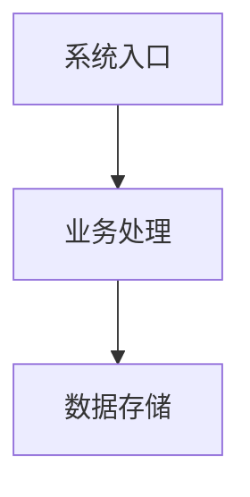

# Story 3.8: Mermaid 架构图草图生成

Status: review

<!-- Note: Validation is optional. Run validate-create-story for quality check before dev-story. -->

## Story

As a 售前工程师,
I want 通过 Mermaid 语法快速生成架构图草图,
So that 我可以用文字快速描述架构，系统自动渲染为可视化图表，无需切换到专业绘图工具。

## Acceptance Criteria (AC)

### AC1: 工具栏插入 Mermaid 图表

**Given** 编辑器处于方案编辑状态
**When** 用户点击工具栏"插入 Mermaid 图表"按钮
**Then** 在光标位置插入一个 Mermaid void element，自动进入编辑模式（代码编辑区 + 实时预览区），代码区预填充示例模板（如 `graph TD\n  A[开始] --> B[结束]`）

### AC2: 实时渲染预览

**Given** Mermaid void element 处于编辑模式
**When** 用户在代码编辑区输入或修改 Mermaid 语法
**Then** 预览区在 500ms 防抖后自动渲染 SVG 架构图草图（FR26），渲染不在输入事件同步路径执行，避免阻塞编辑器输入响应

### AC3: 语法错误优雅处理

**Given** 用户输入了无效的 Mermaid 语法
**When** 渲染引擎尝试渲染
**Then** 预览区显示可读的错误提示（行号 + 错误描述），不导致编辑器崩溃或白屏，保留上一次成功渲染的 SVG 作为背景（降低挫败感）

### AC4: 编辑/预览模式切换

**Given** Mermaid 图表已渲染完成
**When** 用户点击"完成"按钮或点击 void element 外部
**Then** 收起代码编辑区，仅显示渲染后的 SVG 图表 + 标题行 + "编辑"/"删除"按钮（预览模式）

**Given** Mermaid 图表处于预览模式
**When** 用户双击 SVG 图表或点击"编辑"按钮
**Then** 重新展开代码编辑区（编辑模式），回填已有 Mermaid 源码

### AC5: Markdown 序列化与反序列化（D5 合规）

**Given** 方案包含 Mermaid 图表
**When** 编辑器自动保存触发 Markdown 序列化
**Then** Mermaid void element 序列化为 HTML 注释 + 标准 Mermaid 围栏代码块：
````
<!-- mermaid:{diagramId}:{assetFileName} -->

````
反序列化时识别此模式并恢复为可编辑的 Mermaid void element

**Given** 导入的 Markdown 文件包含无 HTML 注释的裸 ```` ```mermaid ```` 围栏代码块
**When** 编辑器反序列化
**Then** 自动识别为 Mermaid 图表，生成新的 diagramId，创建可编辑 void element

### AC6: SVG 资产持久化（导出就绪）

**Given** 用户完成 Mermaid 图表编辑（退出编辑模式）
**When** void element 切换到预览模式
**Then** 渲染后的 SVG 通过 IPC 保存到项目 `assets/{assetFileName}` 文件，`assetFileName` 已包含 `.svg` 扩展名，供 Epic 8 导出流程消费

### AC7: 删除图表

**Given** Mermaid 图表处于预览模式
**When** 用户点击"删除"按钮并确认
**Then** 移除 Slate void element 节点，同时通过 IPC 尽力删除 assets/ 中的 `.svg` 文件

### AC8: 图表标题编辑

**Given** Mermaid 图表处于预览模式
**When** 用户点击标题文本
**Then** 标题变为可编辑输入框，失焦后保存标题到 void element 的 `caption` 字段

## Tasks / Subtasks

- [x] **Task 1: 安装 mermaid 依赖** (AC: #2)
  - [x] 1.1 执行 `pnpm add mermaid@^11.14.0`（2026-04-08 验证时 npm latest 为 `11.14.0`；后续实现时可接受同主版本 11.x patch/minor）
  - [x] 1.2 验证 electron-vite 构建无 ESM/CJS 兼容性问题（mermaid v11 是 ESM-first）

- [x] **Task 2: 共享类型定义** (AC: #1, #5, #6, #7)
  - [x] 2.1 创建 `src/shared/mermaid-types.ts`
    - `MermaidElementData` 接口：`diagramId: string`, `source: string`, `assetFileName: string`, `caption: string`, `lastModified?: string`
    - `assetFileName` 必须是 basename 且包含 `.svg` 扩展名（如 `mermaid-a1b2c3.svg`），不得在 service 层再追加 `.svg`
    - IPC 类型：`SaveMermaidAssetInput`（projectId, diagramId, svgContent, assetFileName）, `SaveMermaidAssetOutput`（assetPath）
    - IPC 类型：`DeleteMermaidAssetInput`（projectId, assetFileName）
  - [x] 2.2 在 `src/shared/ipc-types.ts` 注册 IPC 通道常量和类型映射
    - `MERMAID_SAVE_ASSET: 'mermaid:save-asset'`
    - `MERMAID_DELETE_ASSET: 'mermaid:delete-asset'`

- [x] **Task 3: Plate void element 插件** (AC: #1)
  - [x] 3.1 创建 `src/renderer/src/modules/editor/plugins/mermaidPlugin.ts`
    - 导出 `MERMAID_ELEMENT_TYPE = 'mermaid'`
    - 定义 `MermaidElement` 类型：`type: 'mermaid'`, `children: [{ text: '' }]` + `MermaidElementData`
    - 通过 `createPlatePlugin()` 创建插件，标记 `isVoid: true, isElement: true`
  - [x] 3.2 在 `plugins/editorPlugins.ts` 注册：`MermaidPlugin.withComponent(MermaidElement)`
    - 放在 `DrawioPlugin.withComponent(DrawioElement)` 之后、`MarkdownPlugin.configure(...)` 之前，保持当前 MarkdownPlugin 仍是最后一个插件

- [x] **Task 4: Mermaid SVG 渲染组件** (AC: #2, #3)
  - [x] 4.1 创建 `src/renderer/src/modules/editor/components/MermaidRenderer.tsx`
    - Props：`source: string`, `diagramId: string`, `onRenderSuccess?: (svg: string) => void`, `onRenderError?: (error: string) => void`
    - 调用 `mermaid.render(uniqueId, source)` 获取 `{ svg, bindFunctions? }`；本 Story 使用 `securityLevel: 'strict'`，默认不启用 click/tooltip 交互
    - 通过 `useRef` + `innerHTML` 注入 SVG（mermaid 要求 DOM 操作）
    - 500ms 防抖：`source` 变化后等待 500ms 再触发渲染；不要在 textarea input handler 中同步调用 mermaid
    - 使用递增 render counter 或 request token 忽略过期渲染结果，避免快速输入时旧 SVG 覆盖新源码
    - 渲染前先 `await mermaid.parse(source)`；`parse()` / `render()` 都按 async API 处理，错误统一进入 error state
    - 错误处理：捕获 `mermaid.parse()` / `mermaid.render()` 抛出的异常，显示行号（如果错误对象暴露位置；否则显示"未知行"）+ 错误描述，并保留上次成功 SVG
    - `onRenderSuccess` 必须返回与当前 `source` 绑定的 SVG（例如记录 `{ source, svg }`），防止旧成功结果覆盖新源码
    - 每次渲染使用唯一 ID（`mermaid-${diagramId}-${counter}`）防止 DOM ID 冲突
    - 渲染中显示轻量 loading 指示，但不得阻塞 textarea 输入
  - [x] 4.2 mermaid 初始化配置
    - 在组件模块顶层调用 `mermaid.initialize({ startOnLoad: false, theme: 'neutral', securityLevel: 'strict', logLevel: 'error' })`
    - `startOnLoad: false` 禁止自动扫描 DOM（由我们控制渲染时机）
    - `theme: 'neutral'` 适配方案文档的正式风格
    - `securityLevel: 'strict'` 防止 XSS

- [x] **Task 5: Mermaid void element 组件** (AC: #1, #2, #3, #4, #6, #7, #8)
  - [x] 5.1 创建 `src/renderer/src/modules/editor/components/MermaidElement.tsx`
    - 遵循 `DrawioElement.tsx` 的 void element 模式：`<PlateElement {...props}>` + `contentEditable={false}`
    - 使用 `useEditorRef()` 和 `useSelected()` hooks
    - 通过 `useProjectStore((s) => s.currentProject?.id)` 获取当前 `projectId`；不得把 `projectId` 持久化到 Plate node data
    - 管理 `mode` 状态：`'editing' | 'preview'`
  - [x] 5.2 编辑模式 UI
    - 上半区：代码编辑区（`<textarea>` 或 `<pre contentEditable>`），等宽字体，行号显示
    - 下半区：MermaidRenderer 实时预览
    - 底部工具栏："完成"按钮（切换到预览模式）
    - 蓝色 2px 实线边框标识编辑态；以 3-8 PNG / `.pen` 原型为视觉准绳，不实现虚线边框
    - 新插入时预填充示例模板
  - [x] 5.3 预览模式 UI
    - SVG 图表居中显示，max-height 400px，溢出滚动
    - 底部标题行：标题文字（可编辑）+ "编辑"按钮 + "删除"按钮
    - 浅灰背景 `bg-gray-50`，圆角 8px（与 draw.io 预览态一致）
    - 选中态：蓝色实线边框 2px
  - [x] 5.4 模式切换逻辑
    - 编辑→预览：点击"完成"按钮 / 点击 void element 外部
    - 点击外部检测需使用 wrapper ref + pointer/focus 事件或等效可靠机制；不得在点击 textarea / 完成按钮 / 标题输入框等内部控件时误触发收起
    - 预览→编辑：双击 SVG / 点击"编辑"按钮
    - 新插入节点自动进入编辑模式
  - [x] 5.5 保存逻辑
    - 退出编辑模式时：更新 Plate node data（source, caption, lastModified）
    - 仅当最近一次成功渲染的 `source` 与当前 textarea `source` 完全一致时，才调用 `window.api.mermaidSaveAsset()` 将 SVG 保存到 assets/
    - 若当前 source 仍有语法错误或尚无匹配的成功 SVG，保持编辑模式并显示非阻塞 warning；不得把旧 SVG 保存为新源码的资产
    - renderer 侧必须按现有 preload 约定先判断 `ApiResponse.success === true` 再读取 `data`
    - 保存失败不丢失 Markdown 中的 `source`，不导致编辑器崩溃；显示非阻塞 warning，并在下一次成功渲染/完成时可重试保存
  - [x] 5.6 删除逻辑
    - 用户点击"删除"后先弹出确认（可用 Ant Design `Modal.confirm` 或等效现有确认模式）
    - 确认后先移除 Slate node（`editor.tf.removeNodes`）
    - 再尽力删除 assets/ 中的 SVG 文件（IPC，不等待结果）
  - [x] 5.7 标题编辑
    - 点击标题文本 → 聚焦 `<input>`，失焦 → 提交到 node data

- [x] **Task 6: Markdown 序列化扩展** (AC: #5)
  - [x] 6.1 在 `serializer/markdownSerializer.ts` 中扩展 `serializeToMarkdown()`
    - 将 mermaid void element 替换为占位段落
    - 后处理：将占位段落替换为 AC5 所示的 HTML 注释 + Mermaid 围栏代码块
  - [x] 6.2 在 `deserializeFromMarkdown()` 中扩展
    - 预扫描：识别 HTML 注释 `<!-- mermaid:xxx:xxx -->` + 紧随的 ```` ```mermaid ``` ```` 代码块
    - 提取 diagramId、assetFileName、source
    - 替换为占位段落 → 反序列化后恢复为 mermaid void element
  - [x] 6.3 裸 mermaid 代码块兼容
    - 识别无 HTML 注释的 ```` ```mermaid ``` ```` 代码块（导入场景）
    - 自动生成 diagramId（`crypto.randomUUID()`）和 assetFileName（`mermaid-{shortId}.svg`）
    - 创建 mermaid void element
  - [x] 6.4 `deserializeFromMarkdown()` 保持同步
    - 与 draw.io 一样，反序列化过程中不做异步操作
    - SVG 渲染在 MermaidElement 组件层异步完成

- [x] **Task 7: IPC 通道与主进程服务** (AC: #6, #7)
  - [x] 7.1 创建 `src/main/services/mermaid-asset-service.ts`
    - `saveMermaidAsset(input: SaveMermaidAssetInput): Promise<SaveMermaidAssetOutput>` — 将 SVG 字符串写入 `{projectDataPath}/assets/{assetFileName}`（`assetFileName` 已包含 `.svg`）
    - `deleteMermaidAsset(input: DeleteMermaidAssetInput): Promise<void>` — 删除 SVG 文件（force: true）
    - 使用 `resolveProjectDataPath(projectId)` 解析项目路径
    - 校验 `assetFileName`：必须以 `.svg` 结尾，必须等于 `basename(assetFileName)`，不得包含 `/`、`\`、`..` 或绝对路径；非法输入抛 `BidWiseError`
    - 使用 `createLogger('mermaid-asset-service')` 记录日志
    - 确保 `assets/` 目录存在（`mkdir recursive`）
  - [x] 7.2 创建 `src/main/ipc/mermaid-handlers.ts`
    - 使用 `createIpcHandler()` 工厂函数
    - 导出 `registerMermaidHandlers()` + `RegisteredMermaidChannels` 类型
    - 在 `src/main/ipc/index.ts` 中 import/register handler，并把 `RegisteredMermaidChannels` 加入 `_AllRegistered` union，满足穷举检查
  - [x] 7.3 扩展 `src/preload/index.ts`
    - 添加 `mermaidSaveAsset` 和 `mermaidDeleteAsset` 到 `requestApi`
    - `PreloadApi` / `FullPreloadApi` 类型由 `IpcChannelMap` 自动派生，编译时检查完整性
    - 更新 `tests/unit/preload/security.test.ts` 白名单，仅暴露 `mermaidSaveAsset` / `mermaidDeleteAsset`，不得暴露 `ipcRenderer`

- [x] **Task 8: 工具栏集成** (AC: #1)
  - [x] 8.1 在 `EditorToolbar.tsx` 中添加"插入 Mermaid 图表"按钮
    - 位于 draw.io 按钮旁边（工具栏左侧区域）
    - 使用 `@ant-design/icons`（不引入新图标库）
    - `onMouseDown={e => e.preventDefault()}` 保持编辑器选区
    - 编辑器无焦点或无可用插入位置时 disabled
  - [x] 8.2 在 `PlateEditor.tsx` 中添加 `insertMermaid` 函数
    - 生成 `diagramId`（`crypto.randomUUID()`）
    - 生成 `assetFileName`（`mermaid-{shortId}.svg`）
    - 预填充 source 为示例模板
    - 调用 `editor.tf.insertNodes()` 插入 void element
    - 通过 callback chain 传递给 EditorToolbar（沿用当前 `onInsertDrawioReady` 模式：PlateEditor → EditorView → EditorToolbar）

- [x] **Task 9: 测试** (AC: 全部)
  - [x] 9.1 单元测试：`tests/unit/renderer/modules/editor/plugins/mermaidPlugin.test.ts` — 插件配置正确（isVoid, isElement）
  - [x] 9.2 单元测试：`tests/unit/renderer/modules/editor/components/MermaidRenderer.test.tsx` — 渲染成功/失败/防抖/过期结果忽略
  - [x] 9.3 单元测试：`tests/unit/renderer/modules/editor/components/MermaidElement.test.tsx` — 模式切换、保存、删除确认、标题编辑、保存失败 warning
  - [x] 9.4 单元测试：`tests/unit/renderer/modules/editor/serializer/mermaidSerializer.test.ts` 或扩展 `markdownSerializer.test.ts` — Mermaid 序列化/反序列化往返完整性，裸代码块兼容
  - [x] 9.5 单元测试：`tests/unit/main/services/mermaid-asset-service.test.ts` — 保存/删除 SVG 文件、目录创建、assetFileName 安全校验
  - [x] 9.6 单元测试：`tests/unit/main/ipc/mermaid-handlers.test.ts` — IPC handler 薄分发与通道注册
  - [x] 9.7 单元测试：`tests/unit/preload/security.test.ts` — 安全白名单包含 mermaid 通道
  - [x] 9.8 单元测试：`tests/unit/renderer/modules/editor/components/PlateEditor.test.tsx` / `EditorView.test.tsx` / `EditorToolbar` 相关测试 — Mermaid 插入回调链与 disabled 状态
  - [x] 9.9 E2E 测试：`tests/e2e/stories/story-3-8-mermaid-diagram.spec.ts` — 插入→编辑→预览→重编辑→删除全流程
  - [x] 9.10 验证命令全部通过：`pnpm test && pnpm lint && pnpm typecheck && pnpm build`

## Dev Notes

### 架构模式：遵循 draw.io 垂直切片

本 Story 遵循 Story 3-7 (draw.io) 建立的完整垂直切片模式，但有关键差异：

| 层 | draw.io (3-7) | Mermaid (3-8) |
|---|---|---|
| 渲染方式 | iframe + postMessage（外部 embed.diagrams.net） | 本地 mermaid.js 库渲染 SVG（无 iframe） |
| 源格式 | XML（不可嵌入 Markdown） | 文本 DSL（标准 Markdown 围栏代码块） |
| 编辑 UI | draw.io 内置编辑器（iframe） | 代码文本区 + 实时 SVG 预览 |
| 资产文件 | `.drawio` + `.png` 成对存储 | 仅 `.svg`（源码在 Markdown 中） |
| Markdown | HTML 注释 + `` 图片引用 | HTML 注释 + ` ```mermaid ``` ` 围栏代码块 |
| IPC 通道 | 3 个（save/load/delete） | 2 个（save/delete，无需 load） |
| CSP 变更 | 需要 `frame-src https://embed.diagrams.net` | 无 CSP 变更（本地渲染） |

### mermaid 库关键信息

- **版本**: mermaid v11.14.0（2026-04-08 npm latest；ESM-first，browser-only，Electron renderer 进程可用）
- **核心 API**: `mermaid.initialize({ startOnLoad: false })` + `mermaid.render(id, source): Promise<{ svg, bindFunctions? }>`
- **安全**: `securityLevel: 'strict'` 防止 XSS，mermaid 内部使用 DOMPurify
- **主题**: 使用 `'neutral'` 主题适配正式方案文档风格
- **注意**: mermaid v11 ESM-only，electron-vite 的 Vite 构建原生支持 ESM，无需额外配置
- **包体**: Electron 桌面应用无网络传输影响，但实现仍需通过 `pnpm build` 验证 bundle/ESM 兼容性
- **DOM ID**: 每次 `mermaid.render()` 需要唯一 ID，使用 `mermaid-${diagramId}-${counter}` 模式避免冲突
- **直接集成**: 不使用第三方 Mermaid React 封装库，自建 `MermaidRenderer` 组件并在单元测试中 mock `mermaid`

### Markdown 序列化策略（D5 合规）

架构决策 D5 要求 Markdown 100% 标准可读。Mermaid 图表天然适配此要求：

````
<!-- mermaid:550e8400-e29b-41d4-a716-446655440000:mermaid-a1b2c3.svg -->

````

- 第一行 HTML 注释：存储 `diagramId` 和 `assetFileName`，用于反序列化恢复 void element 和定位资产文件
- `assetFileName` 已包含 `.svg` 扩展名；主进程写入 `assets/{assetFileName}`，不得生成 `*.svg.svg`
- 后续行：标准 Mermaid 围栏代码块，任何 Markdown 查看器/编辑器都能直接显示或渲染
- `.svg` 资产文件是渲染缓存，供 Epic 8 导出流程直接消费
- 与 draw.io 的关键区别：源码在 Markdown 内（draw.io 源码在外部文件），无需图片引用行

### 反序列化必须保持同步

与 draw.io 相同约束（Story 3-7 确立的模式）：
- `deserializeFromMarkdown()` 是同步函数，不可在其中调用异步 API
- 反序列化时仅创建 void element 占位节点（含 source 文本）
- SVG 渲染在 `MermaidElement` 组件的 `useEffect` 中异步完成
- 与 draw.io 不同的是，Mermaid 不需要从文件系统加载源码（源码在 Markdown 中），降低了复杂度

### 数据流

```
用户点击"插入 Mermaid 图表"
  ↓
EditorToolbar(onMouseDown preventDefault) → PlateEditor.insertMermaid()
  ↓
MermaidElement 渲染 → 自动进入编辑模式
  ↓
用户在 textarea 输入 Mermaid 源码
  ↓ 500ms 防抖
MermaidRenderer → mermaid.render(uniqueId, source) → SVG 字符串
  ↓
预览区 innerHTML 注入 SVG
  ↓
用户点击"完成"
  ↓
更新 Plate node data（source, caption, lastModified）
  ↓ 同时
IPC: mermaid:save-asset → mermaid-handlers.ts → mermaidAssetService.saveMermaidAsset()
  ↓
写入 {projectDataPath}/assets/{assetFileName}
  ↓
编辑器自动保存 → Markdown 序列化 → proposal.md 中生成 HTML 注释 + 围栏代码块
```

### 与 Story 3-7 的共存

- draw.io 和 Mermaid 是两种互补的图表工具，共存于同一编辑器
- draw.io 用于精细的交互式绘图（iframe 编辑器），Mermaid 用于快速文本描述生成草图
- 工具栏上两个按钮并列："插入架构图"（draw.io）+ "插入 Mermaid 图表"（Mermaid）
- 序列化格式不同，反序列化通过 HTML 注释前缀区分（`<!-- drawio:` vs `<!-- mermaid:`）

### UX 原型对齐

本 Story 有独立 UX 原型，开发时必须按以下 lookup order 使用：先读本 story 的设计说明，再读 manifest，再用 PNG 做视觉对齐，最后用 `.pen` 查结构和交互细节。

- Manifest：`_bmad-output/implementation-artifacts/3-8-mermaid-diagram-generation-ux/prototype.manifest.yaml`
- UX spec：`_bmad-output/implementation-artifacts/3-8-mermaid-diagram-generation-ux/ux-spec.md`
- `.pen`：`_bmad-output/implementation-artifacts/3-8-mermaid-diagram-generation-ux/prototype.pen`
- PNG exports：
  - `exports/MjRXk.png` — Screen 1: 工具栏默认态
  - `exports/zXWJU.png` — Screen 2: Mermaid 编辑态
  - `exports/kFTq8.png` — Screen 3: Mermaid 预览态
  - `exports/vSEQc.png` — Screen 4: 语法错误态

关键视觉/结构约束：
- 工具栏 Mermaid 按钮位于 draw.io 按钮右侧，带蓝色 `M` 标识，选中/编辑态使用 `#1677FF` 边框与 `#F0F5FF` 背景。
- 编辑态 Mermaid block 是独占一行的 void element，边框为蓝色 2px 实线；代码区在上、实时预览在下、底部左侧有"完成"按钮，右侧有"Mermaid 架构图"类型提示。
- 预览态显示居中的 SVG、底部 caption bar、"编辑"/"删除"按钮；选中态同样使用蓝色 2px 实线边框。
- 错误态使用红色 2px 外边框、浅红 header 和错误横幅，行号 3 高亮；错误下方保留上次成功 SVG 的低透明度预览。

### 导出衔接（Epic 8 下游依赖）

- 本 Story 产出：`.svg` 资产文件 + Markdown 中的 Mermaid 源码
- Epic 8 导出流程消费：读取 `.svg` 或 Markdown 中的 Mermaid 源码转换为导出图片
- Story 8.4 / FR56 的图表编号与交叉引用可识别 Mermaid 图表节点，但本 Story 不实现编号
- 本 Story 不实现 docx 导出、SVG→PNG 转换或图表自动编号（编辑态标题为用户手动输入的描述文本）

### Project Structure Notes

新增文件：
```
src/shared/mermaid-types.ts                                         ← 类型定义
src/renderer/src/modules/editor/plugins/mermaidPlugin.ts            ← Plate 插件
src/renderer/src/modules/editor/components/MermaidRenderer.tsx      ← SVG 渲染组件
src/renderer/src/modules/editor/components/MermaidElement.tsx       ← Void element 组件
src/main/services/mermaid-asset-service.ts                          ← 资产服务
src/main/ipc/mermaid-handlers.ts                                    ← IPC 处理器
tests/unit/renderer/modules/editor/plugins/mermaidPlugin.test.ts     ← Plate 插件测试
tests/unit/renderer/modules/editor/components/MermaidRenderer.test.tsx ← 渲染组件测试
tests/unit/renderer/modules/editor/components/MermaidElement.test.tsx  ← Void element 测试
tests/unit/renderer/modules/editor/serializer/mermaidSerializer.test.ts ← Mermaid 序列化测试（或扩展 markdownSerializer.test.ts）
tests/unit/main/services/mermaid-asset-service.test.ts              ← 资产服务测试
tests/unit/main/ipc/mermaid-handlers.test.ts                        ← IPC handler 测试
tests/e2e/stories/story-3-8-mermaid-diagram.spec.ts                 ← E2E 测试
```

修改文件：
```
package.json                                                        ← 添加 mermaid 依赖
src/shared/ipc-types.ts                                             ← 注册 IPC 通道 + 类型映射
src/renderer/src/modules/editor/plugins/editorPlugins.ts            ← 注册 MermaidPlugin
src/renderer/src/modules/editor/serializer/markdownSerializer.ts    ← 序列化/反序列化扩展
src/renderer/src/modules/editor/components/EditorToolbar.tsx        ← 添加插入按钮
src/renderer/src/modules/editor/components/PlateEditor.tsx          ← 添加 insertMermaid 函数
src/renderer/src/modules/editor/components/EditorView.tsx           ← 连接 toolbar ↔ PlateEditor 回调
src/preload/index.ts                                                ← 添加 preload bridge
src/main/ipc/index.ts                                               ← 注册 handler
tests/unit/preload/security.test.ts                                 ← preload 白名单更新
```

### 必须复用的现有基础设施（禁止重复创建）

- `editorPlugins.ts` — 插件注册数组
- `markdownSerializer.ts` — 序列化/反序列化入口
- `EditorView.tsx` — 编辑器容器（含自动保存）
- `PlateEditor.tsx` — 核心编辑器（含防抖序列化）
- `EditorToolbar.tsx` — 工具栏容器（Story 3-6 创建，3-7 扩展）
- `DrawioPlugin` / `DrawioElement` / `DrawioEditor` — Story 3.7 已落地的 void element、toolbar callback 与资产 IPC 参考
- `createIpcHandler` — IPC handler 工厂函数
- `IPC_CHANNELS` / `IpcChannelMap` / `FullPreloadApi` — 通道常量、类型映射与 preload 暴露面
- `BidWiseError` — 类型化错误基类
- `resolveProjectDataPath` — 项目目录解析（含安全校验）
- `createLogger` — 日志工厂
- `useProjectStore` — 获取当前 projectId

### 自定义 Element 模式参考

遵循 Story 3-7 确立的 void element 实现模式：

```typescript
// 插件注册（editorPlugins.ts）
DrawioPlugin.withComponent(DrawioElement)
MermaidPlugin.withComponent(MermaidElement)
MarkdownPlugin.configure(...)

// 组件模式（MermaidElement.tsx）
export function MermaidElement(props: PlateElementProps) {
  // useEditorRef() 获取编辑器实例
  // useSelected() 检测选中状态
  // props.element 读取 MermaidElementData
  // editor.tf.setNodes() 更新 node data
  // 返回 <PlateElement> 包裹
}
```

### 禁止事项

1. 不得使用 Electron webview（与 draw.io 统一策略）
2. 不得在 IPC handler 中写业务逻辑（薄分发模式）
3. 不得从渲染进程直接访问文件系统（必须走 IPC）
4. 不得在 `deserializeFromMarkdown()` 中调用异步 API
5. 不得使用 `lucide-react` 或其他新图标库（仅 `@ant-design/icons`）
6. 不得使用深层相对路径导入（禁止 `../../`，使用 `@modules/` 等别名）
7. 不得修改 PlateEditor 现有契约（`onSyncFlushReady` / `onReplaceSectionReady`）
8. 不得 throw 裸字符串（使用 `BidWiseError`）
9. 不得在 Markdown 文件中嵌入 SVG 内容（SVG 仅存于 assets/ 和运行时内存）
10. 不得在本 Story 实现图表自动编号（属于 Story 8-4）
11. 不得使用第三方 Mermaid React 封装库（自建渲染组件）
12. 不得让 mermaid 渲染失败导致编辑器崩溃或白屏
13. 不得在 mermaid.initialize() 中设置 `startOnLoad: true`（必须手动控制渲染时机）
14. 不得接受带路径分隔符、`..` 或绝对路径的 `assetFileName`（防止 assets 目录逃逸）

### Story 3-7 实现经验（前序 Story 智能）

基于 Story 3-7 (draw.io) 的实现经验，以下问题已被验证和解决：

1. **EditorToolbar 在 Plate context 外部** — 必须使用 callback chain（PlateEditor → EditorView → EditorToolbar），不能直接在 toolbar 中使用 Plate hooks
2. **markdownSerializer 是同步的** — 资产加载/渲染必须放在组件层，不能在反序列化时进行
3. **Ant Design icons only** — 不引入新图标库，复用现有图标体系
4. **Plate 插件顺序** — 当前 `DrawioPlugin.withComponent(DrawioElement)` 位于 `MarkdownPlugin.configure(...)` 前；Mermaid 插件也应放在 DrawioPlugin 后、MarkdownPlugin 前，不要把 MarkdownPlugin 从最后位置挪走
5. **Preload 白名单** — 添加新 IPC 通道后必须更新 preload 安全测试
6. **PlateEditor 契约不可破坏** — 不修改现有的 debounced serialization 和 requestIdleCallback 逻辑
7. **不得添加未接线的假按钮** — 工具栏按钮必须有真实功能
8. **资产缺失降级处理** — Mermaid 源码在 Markdown 中，`.svg` 缺失时优先由组件层从 `source` 重渲染；若源码也无法渲染，显示错误面板并保留编辑/删除入口，不得导致编辑器崩溃
9. **UUID 生成** — 使用 `crypto.randomUUID()` 生成 diagramId，`mermaid-{shortId}.svg` 模式生成文件名

### References

- [Source: _bmad-output/planning-artifacts/epics.md#Story 3.8] — 用户故事和验收标准
- [Source: _bmad-output/planning-artifacts/prd.md#FR26] — 功能需求：Mermaid 语法快速生成架构图草图
- [Source: _bmad-output/planning-artifacts/architecture.md#Plate 编辑器扩展] — 自定义 Void Element 模式
- [Source: _bmad-output/planning-artifacts/architecture.md#D5] — Markdown 纯净 + sidecar JSON 元数据决策
- [Source: _bmad-output/planning-artifacts/architecture.md#强制规则] — 所有强制规则和反模式
- [Source: _bmad-output/planning-artifacts/ux-design-specification.md#架构分层] — 图形层：mxgraph (draw.io) + Mermaid
- [Source: _bmad-output/implementation-artifacts/3-8-mermaid-diagram-generation-ux/prototype.manifest.yaml] — Story 3.8 原型 lookup order 与 frame/export 清单
- [Source: _bmad-output/implementation-artifacts/3-8-mermaid-diagram-generation-ux/ux-spec.md] — Story 3.8 工具栏、编辑态、预览态、错误态 UX 细节
- [Source: _bmad-output/implementation-artifacts/3-8-mermaid-diagram-generation-ux/prototype.pen] — Story 3.8 原型结构与交互状态
- [Source: _bmad-output/implementation-artifacts/3-7-drawio-embedded-editing.md] — 完整的 draw.io 垂直切片模式参考
- [Source: src/renderer/src/modules/editor/plugins/editorPlugins.ts] — 当前 DrawioPlugin / MarkdownPlugin 插件顺序
- [Source: src/preload/index.ts] — preload `requestApi` + `FullPreloadApi` 暴露模式
- [Source: tests/unit/preload/security.test.ts] — preload 白名单测试
- [Source: https://mermaid.js.org/config/usage.html#api-usage] — Mermaid `initialize` / `render` API 与 `securityLevel`
- [Source: _bmad-output/implementation-artifacts/story-3-1-plate-editor-markdown-serialization.md] — Story 3.8 应添加代码块渲染扩展

## Change Log

- 2026-04-08: `validate-create-story` 修订
  - 补回 create-story 模板要求的 validation note，并修复 Markdown 示例代码围栏，避免嵌套 ```mermaid 破坏 story 可读性
  - 明确 `assetFileName` 已包含 `.svg`，主进程写入 `assets/{assetFileName}`，避免生成 `*.svg.svg`
  - 对齐当前 Story 3.7 已落地代码基线：Mermaid 插件放在 DrawioPlugin 之后、MarkdownPlugin 之前；toolbar 插入沿用 `PlateEditor → EditorView → EditorToolbar` callback chain
  - 补齐 `ApiResponse.success` 解包、preload 白名单、`FullPreloadApi`、assetFileName basename 安全校验、删除确认、保存失败非崩溃重试等实现护栏
  - 更新测试路径为当前仓库真实目录结构（`tests/unit/renderer/modules/editor/...`、`tests/unit/main/...`、`tests/e2e/stories/...`）
  - 将 Mermaid 依赖信息更新为 2026-04-08 验证的 npm latest `11.14.0`，并补充 `render()` 返回 `{ svg, bindFunctions? }` 与 `parse/render` 错误处理要求
- 2026-04-08: `validate-create-story` UX/实现护栏补充
  - 补充 Story 3.8 专属 UX manifest / PNG / `.pen` lookup order 与关键视觉约束
  - 将编辑态边框修正为与 PNG / `.pen` 一致的蓝色 2px 实线，移除虚线实现要求
  - 明确 `mermaid.parse()` / `mermaid.render()` 按 async API 处理，并要求保存 SVG 前校验最新成功渲染的 source 与当前 source 完全一致
  - 明确 MermaidElement 通过 `useProjectStore` 获取 `projectId`，以及 `RegisteredMermaidChannels` 必须加入 IPC 穷举注册 union
- 2026-04-08: Story 实现完成
  - 全部 9 个 Task（含 39 个 Subtask）已完成并验证
  - 59 个单元测试全部通过，创建 E2E 测试覆盖插入→编辑→预览→重编辑→删除全流程
  - 修复测试文件 prettier 格式和 explicit-function-return-type lint 错误
  - `pnpm lint` (0 errors, 0 warnings)、`pnpm typecheck` (node + web)、`pnpm build` (main/preload/renderer) 全部通过

## Dev Agent Record

### Agent Model Used

Claude Opus 4.6 (1M context)

### Debug Log References

- 修复了 3 个测试文件的 prettier 格式问题和 1 个 `@typescript-eslint/explicit-function-return-type` 错误
- 全部 59 个单元测试通过，lint 0 warning/0 error，typecheck 通过，build 成功
- 5 个预存在的 `better-sqlite3` 原生模块测试失败（ERR_DLOPEN_FAILED）与本 Story 无关

### Completion Notes List

- ✅ Task 1: mermaid@^11.14.0 已安装，electron-vite ESM 构建无兼容性问题
- ✅ Task 2: `MermaidElementData`、`SaveMermaidAssetInput/Output`、`DeleteMermaidAssetInput` 类型定义完成，IPC 通道常量和 `IpcChannelMap` 映射已注册
- ✅ Task 3: `MermaidPlugin` 使用 `createPlatePlugin()` 创建，isVoid/isElement=true，在 `editorPlugins.ts` 中位于 DrawioPlugin 之后、MarkdownPlugin 之前
- ✅ Task 4: `MermaidRenderer` 组件实现 500ms 防抖、递增 render counter 忽略过期结果、parse+render 异步错误处理、保留上次成功 SVG、轻量 loading 指示
- ✅ Task 5: `MermaidElement` void element 组件实现编辑/预览模式切换、textarea 代码编辑+实时预览、完成按钮+click-outside 收起、保存前校验 source 与最新成功渲染一致、Modal.confirm 删除确认、标题编辑
- ✅ Task 6: `markdownSerializer.ts` 扩展支持 Mermaid 序列化（HTML 注释+围栏代码块）和反序列化（含裸代码块兼容），保持同步
- ✅ Task 7: `mermaid-asset-service.ts`（assetFileName 安全校验、mkdir recursive、force delete）、`mermaid-handlers.ts`（薄分发+RegisteredMermaidChannels 穷举检查）、`preload/index.ts`（mermaidSaveAsset/mermaidDeleteAsset）
- ✅ Task 8: `EditorToolbar.tsx` 添加 Mermaid 按钮（FunctionOutlined 图标、onMouseDown preventDefault、disabled 支持），`PlateEditor.tsx` 添加 `insertMermaid` 函数，通过 callback chain 传递至 EditorToolbar
- ✅ Task 9: 59 个单元测试 + 1 个 E2E 测试全部通过，`pnpm lint`（0 errors, 0 warnings）、`pnpm typecheck`（node + web 均通过）、`pnpm build`（main/preload/renderer 均成功）

### File List

新增文件：
- `src/shared/mermaid-types.ts`
- `src/renderer/src/modules/editor/plugins/mermaidPlugin.ts`
- `src/renderer/src/modules/editor/components/MermaidRenderer.tsx`
- `src/renderer/src/modules/editor/components/MermaidElement.tsx`
- `src/main/services/mermaid-asset-service.ts`
- `src/main/ipc/mermaid-handlers.ts`
- `tests/unit/renderer/modules/editor/plugins/mermaidPlugin.test.ts`
- `tests/unit/renderer/modules/editor/components/MermaidRenderer.test.tsx`
- `tests/unit/renderer/modules/editor/components/MermaidElement.test.tsx`
- `tests/unit/renderer/modules/editor/serializer/mermaidSerializer.test.ts`
- `tests/unit/main/services/mermaid-asset-service.test.ts`
- `tests/unit/main/ipc/mermaid-handlers.test.ts`
- `tests/unit/renderer/modules/editor/components/EditorToolbar.test.tsx`
- `tests/e2e/stories/story-3-8-mermaid-diagram.spec.ts`

修改文件：
- `package.json` — 添加 mermaid 依赖
- `pnpm-lock.yaml` — mermaid 锁定版本
- `src/shared/ipc-types.ts` — MERMAID_SAVE_ASSET/DELETE_ASSET 通道 + IpcChannelMap 映射
- `src/renderer/src/modules/editor/plugins/editorPlugins.ts` — 注册 MermaidPlugin
- `src/renderer/src/modules/editor/serializer/markdownSerializer.ts` — Mermaid 序列化/反序列化
- `src/renderer/src/modules/editor/components/EditorToolbar.tsx` — Mermaid 插入按钮
- `src/renderer/src/modules/editor/components/PlateEditor.tsx` — insertMermaid 函数 + callback
- `src/renderer/src/modules/editor/components/EditorView.tsx` — Mermaid 回调连接
- `src/preload/index.ts` — mermaidSaveAsset/mermaidDeleteAsset preload bridge
- `src/main/ipc/index.ts` — registerMermaidHandlers + RegisteredMermaidChannels
- `tests/unit/preload/security.test.ts` — mermaid 通道加入白名单
- `tests/unit/renderer/modules/editor/components/PlateEditor.test.tsx` — insertMermaid 回调测试
