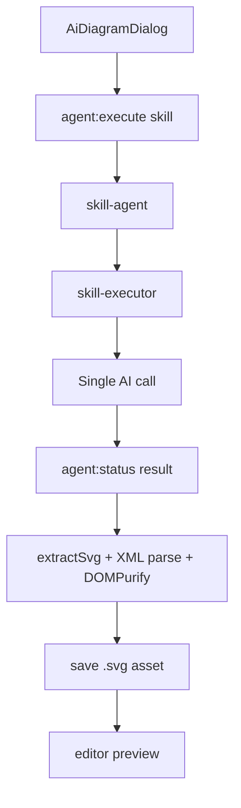
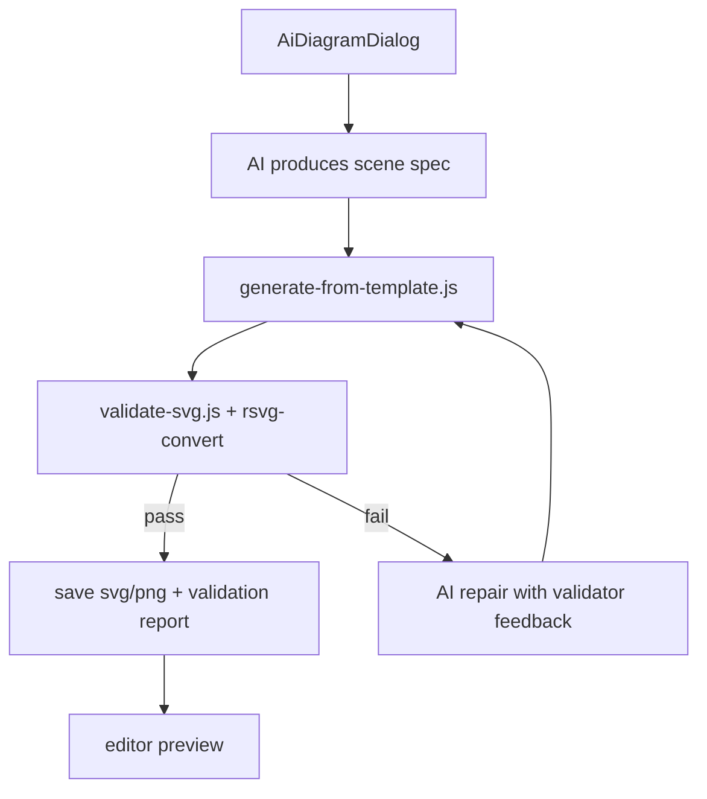

# Architecture Analysis: AI Diagram Skill Capability Gap

**Date:** 2026-04-16
**Scope:** `fireworks-tech-graph` integration in the editor-side AI diagram flow, including renderer entry, `skill-engine`, vendored skill assets/scripts, and export-adjacent quality gates.
**Questions:** How much of `fireworks-tech-graph`'s real capability is currently exercised by BidWise, where are the missing links, and which gaps most directly cause weak layout and connector quality?
**Time Box:** 45 minutes

## Summary

BidWise currently uses `fireworks-tech-graph` as a prompt-only SVG generator. The shipped feature exercises the skill's text instructions and raw SVG output contract, while leaving its strongest assets largely unused: structured template rendering, orthogonal routing, collision checks, SVG validation, and PNG export validation.

The largest gap is architectural: the current `skill-engine` can expand prompt text and run pre-prompt shell snippets, but it has no post-generation orchestration step. That means the skill's helper scripts and geometry engine never enter the runtime path that produces diagrams in the editor.

## Analysis Question

How much of the vendored `fireworks-tech-graph` skill is activated by the current AI diagram feature, and what gaps prevent BidWise from using the skill's full layout, routing, and validation capability?

## Scope

In scope:

- Editor-side AI diagram generation flow
- `skill-engine` execution model
- Vendored `fireworks-tech-graph` skill body, references, and scripts
- Current SVG extraction, validation, and persistence path
- Capability comparison against the more mature chapter diagram pipeline

Out of scope:

- General Mermaid / draw.io chapter generation quality, except as an internal comparison point
- Python docx renderer internals
- End-user visual redesign of the editor UI

## Tech Stack

- Desktop shell: Electron + React + TypeScript
- AI execution: `agent-orchestrator` + `task-queue` + `ai-proxy`
- Skill runtime: local `skill-engine`
- Diagram output: sanitized inline SVG asset
- Existing skill assets: Node.js helper scripts in `src/main/skills/fireworks-tech-graph/scripts/`

## Architecture Overview

The current AI diagram feature follows a direct path:

1. Renderer opens `AiDiagramDialog`
2. Dialog calls `window.api.agentExecute({ agentType: 'skill', context: { skillName: 'fireworks-tech-graph', ... } })`
3. `skill-agent` loads the vendored `SKILL.md`, expands prompt text, and sends one AI request
4. Renderer polls task status, extracts the first `<svg>...</svg>`, runs XML parse + DOMPurify sanitize, and inserts the result into the editor
5. Asset is saved as `.svg`

This path never invokes:

- `generate-from-template.js`
- `validate-svg.js`
- `generate-diagram.js`
- the skill's orthogonal routing engine
- the skill's collision detection logic
- any repair loop driven by validator feedback

### Current Flow

### Full-Capability Target

## Component Map

- `src/renderer/src/modules/editor/components/AiDiagramDialog.tsx`
  - Entry point for user-driven AI diagram generation
  - Calls skill agent and only handles progress, polling, SVG extraction, and error display
- `src/renderer/src/modules/editor/utils/aiDiagramSvg.ts`
  - Performs minimal client-side guardrails: extract first SVG, XML parse, sanitize
  - Does not validate geometry, routing quality, label overlap, or exportability
- `src/main/services/agent-orchestrator/agents/skill-agent.ts`
  - Thin adapter from `skillName` to `AiRequestParams`
  - No skill-specific post-processing, validation, or retry logic
- `src/main/services/skill-engine/skill-executor.ts`
  - Expands prompt body, substitutes args, optionally runs pre-prompt shell snippets, then builds AI messages
  - No post-response scripting phase
- `src/main/skills/fireworks-tech-graph/SKILL.md`
  - Contains detailed rules, helper script recommendations, and examples
  - Functions today as prompt text, not as an executable workflow
- `src/main/skills/fireworks-tech-graph/scripts/generate-from-template.js`
  - Contains the strongest geometry capability: anchor selection, orthogonal routing, lane scoring, obstacle avoidance
- `src/main/skills/fireworks-tech-graph/scripts/validate-svg.js`
  - Performs syntax checks, marker checks, arrow collision checks, and `rsvg-convert` validation
- `src/main/services/agent-orchestrator/agents/generate-agent.ts`
  - Internal comparison point
  - Already implements a richer generate -> validate -> repair loop for chapter diagrams

## End-to-End Data Flow

### Current AI Diagram Flow

1. User enters prompt, style, and diagram type in `AiDiagramDialog`
2. Renderer sends one `skill` request with positional args
3. `skill-agent` loads `SKILL.md` and passes its expanded body as prompt text
4. AI returns raw text that is expected to contain one SVG document
5. Renderer extracts first SVG block and applies basic XML + sanitize checks
6. SVG is inserted and persisted

### Missing Flow Stages

1. AI never produces a structured scene model
2. Skill scripts never render the scene through the routing engine
3. Skill validators never inspect the generated SVG
4. Validation errors never feed a repair loop
5. Exportability is not checked before the editor accepts the diagram

## Capability Matrix

| Skill capability | Present in vendored skill | Used in product flow | Gap |
| --- | --- | --- | --- |
| Raw SVG prompt instructions | Yes | Yes | Low |
| Style and icon reference files | Yes | No runtime loading | High |
| Helper script examples | Yes | No invocation | High |
| Structured template rendering | Yes | No | High |
| Orthogonal routing and anchor snapping | Yes | No | Critical |
| Obstacle avoidance and lane scoring | Yes | No | Critical |
| Arrow collision validation | Yes | No | Critical |
| `rsvg-convert` export validation | Yes | No | High |
| Validator-driven repair loop | Skill implies it, codebase has similar pattern elsewhere | No | Critical |
| Persisted PNG companion asset | Script supports export | No editor-time use | Medium |

## Findings

### 1. The integration currently uses the skill as prompt text, not as a workflow

`skill-executor` expands the `SKILL.md` body into prompt text and then builds AI messages. It does not interpret narrative instructions like "load reference file" or "use helper script" as executable actions. Only custom shell markers are executable, and they run before the AI call.

Impact:

- `references/style-*.md`
- `references/icons.md`
- helper script examples

all remain advisory text unless their contents are explicitly injected or executed.

### 2. The skill's strongest assets live in scripts that never enter the current runtime path

The vendored skill ships high-value scripts:

- `generate-from-template.js`
- `validate-svg.js`
- `generate-diagram.js`

The current editor flow never calls them. Repository search shows no runtime call sites for these scripts in the product path. The only active path is raw model output -> sanitize -> save.

Impact:

- The orthogonal router is unused
- Arrow anchoring by node edge is unused
- Collision detection is unused
- `rsvg-convert` compatibility is unchecked

### 3. The current `skill-engine` design cannot realize post-generation validation by itself

`skill-executor` can only run shell commands during prompt expansion. Validation scripts for SVG need the generated SVG as input, which only exists after the AI response. The current architecture has no native "after model response, run script, then repair" stage for skills.

Impact:

- Even if `SKILL.md` were edited to mention validators more strongly, the engine still would not execute them at the right time
- Reaching full skill capability requires orchestration outside plain `SKILL.md`

### 4. The product accepts diagrams after only lightweight safety checks

Current checks in `aiDiagramSvg.ts`:

- extract first SVG
- XML parse
- root element check
- DOMPurify sanitize
- external reference stripping

These checks are necessary for safety. They do not assess:

- connector routing quality
- arrow-through-node collisions
- label overlap
- text overflow
- `rsvg-convert` render success

Impact:

- Layout defects pass as "valid" if the SVG is syntactically well-formed

### 5. The skill already contains a geometry engine stronger than the product path

`generate-from-template.js` includes:

- source / target node binding
- source_port / target_port edge anchoring
- orthogonal route candidate generation
- obstacle expansion and collision rejection
- route scoring via lane hints
- label placement that avoids occupied bounds

This is materially stronger than asking a model to freehand SVG paths.

Impact:

- Current layout and connector problems come from bypassing the engine that was designed to solve them

### 6. There is an internal reference implementation for the missing pattern

The chapter diagram pipeline in `generate-agent.ts` already implements:

- staged generation
- validator calls
- repair prompt retries
- failure downgrade paths

Impact:

- BidWise already has the orchestration pattern needed to unlock more of the skill's capability
- The gap is integration work, not conceptual uncertainty

### 7. The vendored skill package is incomplete as a reusable asset bundle

`generate-from-template.js` references a `templates/` directory for template viewBox loading. The current vendored skill directory contains `references/`, `scripts/`, and `fixtures/`, but no `templates/` directory.

Impact:

- The script still has default viewBox fallbacks, so it is not blocked
- The vendored skill is still incomplete relative to its own structure and examples

## Risks and Tech Debt

| Risk | Severity | Location | Impact |
| --- | --- | --- | --- |
| Prompt-only integration bypasses routing engine | Critical | `AiDiagramDialog` -> `skill-agent` -> raw SVG | Layout and connector quality remain unstable |
| No post-generation validator phase | Critical | `skill-engine` / editor diagram flow | Broken geometry enters documents unchecked |
| No repair loop for skill output | Critical | AI diagram flow | Failures require full regeneration instead of targeted fix |
| Reference files are not actually loaded | High | `SKILL.md` + `skill-executor` | Style fidelity and icon consistency depend on model recall |
| Export/render compatibility unchecked at insert time | High | editor acceptance path | Some diagrams can preview but fail later in export |
| Vendored skill assets incomplete | Medium | missing `templates/` directory | Limits full reuse of generator assumptions |
| No diagram-specific observability | Medium | AI diagram flow | Hard to distinguish syntax, geometry, and export failures |

## Gap Inventory

### Critical Gaps

1. No structured scene-spec stage before rendering
2. No use of `generate-from-template.js` routing and layout engine
3. No invocation of `validate-svg.js`
4. No validator-driven repair loop

### High Gaps

1. Skill references are not injected into prompt context
2. `rsvg-convert` validation is absent from the acceptance path
3. Output contract stops at sanitized SVG, with no geometry quality contract

### Medium Gaps

1. Missing `templates/` asset directory in the vendored skill
2. No validation artifact or debug trace stored with saved diagrams
3. No lightweight user controls for reroute / relayout after generation

## Recommendations

1. Introduce a dedicated AI diagram generation service in `src/main/services/` and move the current direct renderer-side acceptance flow behind it.
   - Responsibility: generate scene spec, call template renderer, validate output, optionally repair, then return a wrapped response
   - This keeps IPC thin and matches repository architecture rules

2. Change the model contract from "return final SVG" to "return scene spec JSON" for complex diagram types.
   - Minimum scene spec fields: `title`, `nodes`, `containers`, `arrows`, `style`, `viewBox`
   - Require `source`, `target`, `source_port`, `target_port` on arrows whenever possible
   - Let `generate-from-template.js` own routing

3. Add a generate -> validate -> repair loop for AI diagrams, borrowing the pattern already used by chapter diagrams.
   - Round 1: scene spec -> SVG render
   - Validate with `validate-svg.js`
   - If failed, feed validator output into a repair prompt or repair function
   - Max 2-3 attempts, then degrade to a clear failure

4. Add a skill resource loader for reference markdown when a skill explicitly depends on local reference files.
   - For `fireworks-tech-graph`, inject the selected style reference and `icons.md`
   - This closes the gap between "skill says load reference" and what the runtime actually does

5. Add `rsvg-convert` validation before accepting the diagram as persisted success.
   - Store validator output with the asset for debugging
   - Expose precise failure class in UI: syntax, geometry, export, or persistence

6. Complete the vendored skill asset bundle.
   - Add the missing `templates/` directory if upstream includes it
   - Audit for any other missing runtime resources

7. Add small editor-side recovery controls after generation.
   - `Re-layout`
   - `Re-route connectors`
   - `Increase spacing`
   - `Change edge anchoring`

## Recommended Delivery Sequence

### Phase 1: Highest leverage

1. Main-process AI diagram service
2. `validate-svg.js` invocation
3. Repair loop

### Phase 2: Quality jump

1. Scene spec JSON contract
2. `generate-from-template.js` rendering
3. reference file injection

### Phase 3: Finish and harden

1. `rsvg-convert` acceptance gate
2. validation report persistence
3. editor-side reroute / relayout tools
4. vendored skill asset completeness audit

## Final Assessment

BidWise has integrated `fireworks-tech-graph` as a prompt contract, and has not yet integrated it as a rendering-and-validation subsystem. The result is that the current feature uses the weakest part of the skill and bypasses the part that actually solves layout and connector quality.

The missing capability is not inside the skill. The missing capability is the orchestration layer between model output and final asset.
