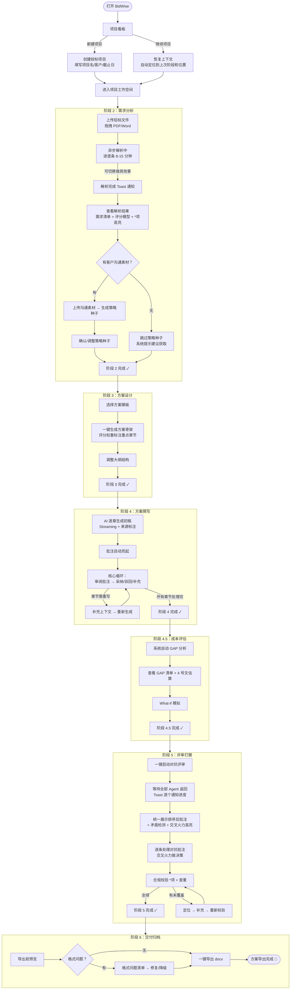
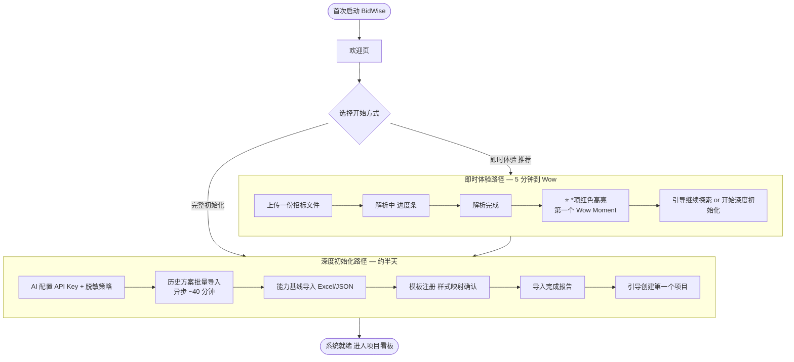
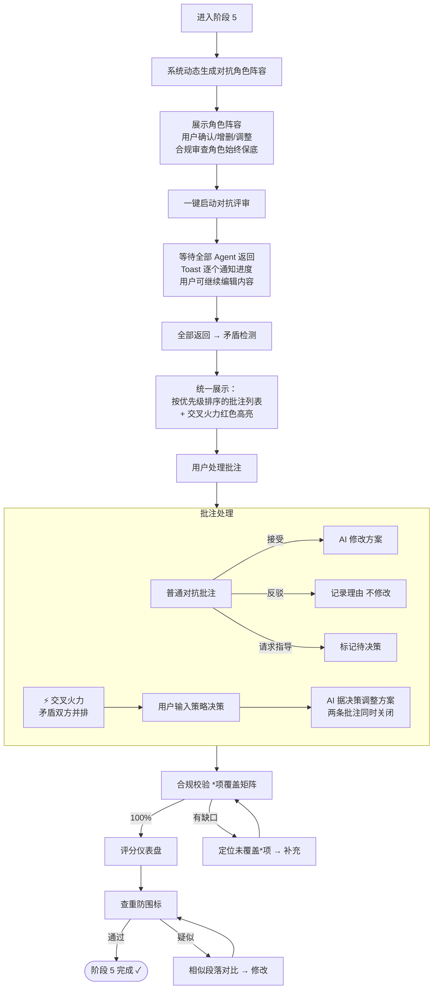

# UX 设计规范 BidWise（标智）

**作者：** Enjoyjavapan
**日期：** 2026-03-17

---

## 执行摘要

### 产品愿景

BidWise（标智）是基于 Electron 的本地桌面投标作战工作台，面向军工体系工业软件公司的售前工程师团队。产品以行业标准的 6 阶段投标 SOP（需求分析→方案设计→方案撰写→成本评估→评审打磨→交付归档）为导航骨架，通过 AI 多 Agent 系统赋能每个阶段，将售前工程师从"方案搬运工"转变为"投标战役指挥官"。

核心设计原则：**SOP 即导航** —— 产品的信息架构以 6 阶段 SOP 为骨架，对新手是培训引导，对专家是可跳过的检查清单。用户打开应用看到投标项目看板，点击项目进入工作空间，顶部 SOP 进度条引导当前阶段。

关键技术约束：本地优先（数据不出本地）、Electron + React 双平台（Windows + macOS）、Python 独立进程渲染 docx、AI 通过本地脱敏代理调用云端。

### 目标用户

**MVP 范围决策：仅聚焦售前工程师一个角色的完整体验。** 商务经理的 What-if 模拟器作为售前工程师自用的成本分析工具存在，不设计独立角色视图。管理看板延迟到 V1.0。

**主要用户（高频日常使用）：**

- **售前工程师（李工画像）**：28 岁，开发转岗售前 2 年，软件技术功底扎实但行业业务知识有限。一人承担投标全流程，同时跟进 2-3 个标，年产 30 份方案。最大痛点：多标并行认知负荷、废标恐惧、历史素材无结构化检索、AI 生成内容需手动排版。期望：3 天交出 7 天质量的方案，自动检查*项，帮我用甲方语言写。
- **售前专家/经理（张总画像）**：38 岁，12 年行业经验。仍亲自写方案，同时承担质量把关和团队指导。核心焦虑：经验无法规模化传承，初级售前写的方案质量不达标。期望：系统沉淀我的经验，初级售前在 SOP 引导下产出 70 分方案，我只需关键决策点介入。

**MVP 外用户（延迟到 V1.0+）：**

- 售前总监（管理看板）、商务经理（独立审批视图）、IT 管理员（部署运维）。

### 关键 UX 设计挑战

1. **信息密度管理**：65 条功能需求在单一 Electron 窗口中组织，需要清晰的层级结构防止用户被淹没。SOP 进度条作为信息架构的一级锚点，各阶段内部子功能通过渐进式揭露呈现。
2. **批注系统的上下文智能**：6 种批注来源（AI 建议/资产推荐/评分预警/对抗反馈/人工批注/跨角色指导）× 多种状态（待处理/已采纳/已驳回/待决策）可能同时产生高密度信息。批注不只需要过滤——需要上下文感知的智能优先级排序：显示顺序由当前 SOP 阶段 + 编辑位置 + 批注类型权重动态决定（如：阶段 5 评审时对抗反馈置顶，阶段 4 撰写时 AI 建议和资产推荐置顶）。
3. **多标并行上下文切换**：用户同时处理 2-5 个投标项目，切换时需无缝恢复上下文（进度、待办、上次编辑位置）。
4. **对抗评审的异步交互范式**：4 维红方 Agent 并行攻击，结果异步返回。需要**非阻塞进度反馈 + 统一批量展示**的设计（Toast 逐个通知角色进度 → 全部返回后统一排序展示 → 矛盾检测 → 高亮矛盾对），交叉火力是产品差异化体验的核心。
5. **冷启动与新手体验**：空系统到有价值的首次使用需要流畅的数据导入向导；新手需在"不挡路"和"足够引导"之间找到平衡。
6. **AI 信任的渐进式构建**：军工领域对 AI 幻觉零容忍。来源标注、基线交叉验证、无来源段落高亮不只是功能——它们是 UX 的核心信任模式。用户需要在每一步都能看到"AI 为什么这么说"，才会从"手动改 70%"逐步过渡到"只需确认 30%"。信任建立曲线应通过行为数据（修改率/采纳率）持续追踪。
7. **长文档编辑体验**：售前方案 50-100+ 页，用户核心动作是阅读和修改大量文本。三个关键维度：①排版可读性——编辑态排版应尽量接近最终 docx 阅读体验，减少认知断裂；②章节导航——始终可见的文档大纲/目录树，支持 100 页方案内快速跳转；③AI/人工内容边界——视觉上清晰区分 AI 生成内容与人工编辑内容（类似淡色背景区分），强化编辑溯源感。
8. **错误与降级状态的优雅体验**：每个 AI 依赖环节和长时间操作都需要明确的"成功/进行中/失败/降级"四种 UX 状态。AI 生成失败提供内联重试+手动编写+跳过选项；OCR 质量差提供原图 vs 识别文本对照校正界面；Git 同步冲突完全隐藏技术概念，展示为资产版本选择；docx 格式问题提供定位+修复指南的结构化清单。

### UX 设计机会

1. **SOP 导航即培训**：6 阶段进度条作为渐进式揭露的天然载体，根据用户经验自适应内容密度——新手看到详细引导，专家看到精简检查清单。SOP 阶段可自由跳转，但导出前系统拦截未完成的合规项（可跳转但带约束的混合模式）。
2. **交叉火力高亮可视化**：矛盾对抗意见的并排展示 + 决策输入是竞品完全没有的交互模式，是产品的"截图传播点"。灰色→红色的矛盾高亮过渡动画本身就是 Wow Moment。
3. **评分驱动分层即时反馈**：评分反馈分为两层——本地规则引擎驱动的"秒级合规分"（覆盖率、字数权重等硬指标，编辑器角落实时跳动）+ LLM 驱动的"分钟级质量分"（内容质量、策略匹配度，手动刷新）。既有游戏化体感，又不给架构施加不可能的实时压力。
4. **编辑态/交付态分离**：富交互编辑（底层 Markdown + AST 渲染富文本，用户无需接触 Markdown 细节）+ 所见即所得的 docx 预览，消除"导出后格式会不会乱"的焦虑。
5. **冷启动两阶段设计**：将冷启动拆分为"即时体验"和"深度初始化"。即时体验：安装后 5 分钟内上传一份招标文件 → *项红色高亮 → 评分标准抽取 → 第一个 Wow Moment（"这能防废标"）。深度初始化：历史方案批量导入、能力基线、模板注册可后台异步进行，不阻塞核心价值体验。
6. **阶段内战术引导 + 微成就感反馈**：项目工作空间内部也需要"现在最该做什么"的战术级优先级建议（基于评分权重、完成度和截止日压力），减轻深夜加班时的认知负荷。处理完对抗批注、合规全绿、导出成功等关键时刻提供微妙的正向反馈（进度条动画、绿色闪烁、分数上升动画），让用户感觉"我在前进，事情在变好"。

### 信息架构骨架

MVP 信息架构仅两层，服务唯一角色（售前工程师）：

```
第一层：项目看板（所有在进行的标 + 智能待办排序）
第二层：项目工作空间
  ├── SOP 进度条导航（6 阶段，可跳转但带约束）
  ├── 主内容区（当前阶段核心操作区）
  ├── 侧边栏（上下文感知的智能批注面板）
  └── 文档大纲树（章节导航，始终可见）
```

**SOP 阶段状态机**：每个阶段具有"未开始 / 进行中 / 已完成 / 有警告"四种状态，驱动进度条视觉表达和导出前拦截逻辑。

**模态策略原则**：
- **侧边面板**：策略种子确认、对抗角色调整、批注详情——不打断主编辑流
- **内联展开**：章节级操作（重新生成、上下文补充）——就地操作
- **模态对话框**：仅用于不可逆/高风险操作——导出确认、删除项目、冷启动向导步骤
- **Toast 通知**：异步完成通知（解析完成、对抗结果返回）——非阻塞提醒

**空状态设计**：每个 SOP 阶段"未开始"时展示引导式占位符——阶段目标说明 + 开始操作入口（如"本阶段目标：理解甲方要什么。请上传招标文件"），而非空白页。

**异步操作模式**：所有长时间操作（招标解析 8-15 分钟、AI 生成 2 分钟/章节、对抗评审 5 分钟）不阻塞主 UI，用户可自由切换项目或章节，完成后通过 Toast 通知回调。

---

## 核心用户体验

### 定义体验

**核心动作：处理 AI 批注并做决策。** 用户的工作循环不是"从零开始写"，而是"AI 生成初稿 → 用户审阅批注 → 采纳/驳回/补充 → AI 迭代"。批注是人机协作的主战场——如果批注体验做好了，用户真正从"写方案的人"变成"指挥投标的人"。

**绝对不能出错的交互：*项合规校验。** 一次遗漏 = 一周白干。合规校验必须是零认知负荷的自动化体验：解析时、编辑时、导出前三层自动拦截，拦截方式为不可忽略的强制确认。

**应该完全无感的交互：**
- 格式排版（编辑时所见即所得，导出时 100% 合规，用户不碰样式设置）
- 资产插入（AI 推荐匹配资产，一键插入，自动适配上下文）
- 项目间切换（点击即恢复上下文，无需"回忆上次做到哪了"）
- 数据保存（实时自动保存，崩溃后零丢失）

### 平台策略

| 维度 | 决策 | 说明 |
|------|------|------|
| 平台 | Electron 桌面应用 | Windows 10/11 + macOS 12+ |
| 交互模式 | 键鼠为主 | 售前工程师在办公室用 24-27 寸显示器，大屏优化 |
| 离线 | 不要求 | 本地操作（编辑/导航/导出）不依赖网络，AI 调用需网络 |
| 本地能力 | 充分利用 | 文件拖拽导入、本地存储无上限、多窗口对比 |
| 键盘效率 | 重度优化 | 高频操作支持快捷键（批注导航、章节跳转、生成触发） |

### 无摩擦交互

**应自动发生、用户无需干预的交互：**

| 交互 | 自动化方式 |
|------|-----------|
| 方案格式排版 | 编辑态 AST 渲染接近终稿效果，导出时模板样式自动映射 |
| 图表编号 | 编辑态占位符标记，导出时按章节位置自动分配编号+交叉引用替换 |
| 资产推荐 | 基于当前章节上下文自动匹配资产库，侧边栏被动推荐 |
| 行业术语替换 | AI 生成时自动应用术语库对照，批注提示替换建议 |
| 数据保存 | 实时自动保存，无保存按钮，崩溃后零丢失 |
| *项跟踪 | 解析时自动识别 → 编辑时实时校验覆盖度 → 导出前最终拦截 |
| 上下文恢复 | 切换项目时自动恢复 SOP 阶段、编辑位置和待办状态 |

**应感觉毫不费力的交互：**

| 交互 | 设计策略 |
|------|---------|
| 招标文件导入 | 拖拽上传 → 异步解析进度条 → 完成通知 → 点击查看结果 |
| 方案骨架生成 | 选模板 → 一键生成大纲 → 评分权重自动标注重点章节 |
| 对抗评审启动 | 一键启动 → Toast 逐个通知进度 → 统一结果呈现 → 逐条处理批注 |
| docx 导出 | 预览确认 → 一键导出 → 格式问题清单（如有） |

### 关键成功时刻

**正向成功时刻：**

| 时刻 | 触发场景 | 用户感受 | UX 要求 |
|------|---------|---------|---------|
| **"这能救命"** | 首次上传招标文件，30 秒后看到*项红色高亮 | 震撼+信任起步 | 冷启动即时体验 5 分钟内到达 |
| **"原来客户真正在意这个"** | 策略种子从会议纪要中提取隐性需求 | 洞察感+价值认同 | 种子展示有推理依据 |
| **"AI 比我想得周全"** | 对抗评审指出自己没想到的问题 | 敬畏+依赖感 | 交叉火力 Wow Moment |
| **"3 天就搞定了"** | 一键导出 docx，格式完美 | 成就感+解放感 | 导出零焦虑 |
| **"这不是我一个人在战斗"** | 资产库推荐张总沉淀的中标方案片段 | 归属感+信心 | 推荐精准，来源可追溯 |

**致命失败时刻：**

| 失败 | 后果 | 设计防线 |
|------|------|---------|
| *项遗漏 | 一周白干，用户永不再信任系统 | 三层校验+导出前不可跳过拦截 |
| AI 编造技术参数 | 公司信誉崩塌 | 来源标注+基线验证+无来源强制确认 |
| 导出格式崩坏 | 资格审查不通过 | 导出前预览+格式降级标注+测试文档校准 |
| 上下文混淆 | 多标并行时把 A 标内容写进 B 标 | 项目数据严格隔离+明确的项目标识视觉 |

### 体验原则

**原则 1：指挥官，不是搬运工**
用户的角色是做决策、定策略、处理矛盾，而不是手动拼装文字和格式。所有机械劳动（生成/排版/编号/格式映射）由系统完成，用户只在"人类判断不可替代"的环节介入。

**原则 2：安全网先于效率**
*项合规校验、AI 幻觉检测、格式完整性——安全机制永远优先于效率优化。即使牺牲一点速度，也绝不让用户在不知情的情况下提交有致命缺陷的方案。安全机制的 UX 表达是"不可忽略的强制确认"，而非"可关闭的警告弹窗"。

**原则 3：透明的 AI**
AI 生成的每一段内容都必须可追溯——来自资产库、知识库还是 AI 推理。无来源内容视觉强制标注。用户在任何时候都能回答"这段话是从哪来的"。透明是信任的前提。

**原则 4：上下文即服务**
系统主动感知用户当前状态（SOP 阶段、编辑位置、截止日压力、完成度），并在正确的时刻提供正确的信息——批注优先级、智能待办、战术引导、资产推荐。用户不需要"去找信息"，信息来找用户。

**原则 5：局部失败不阻塞全局**
单章节 AI 生成失败不影响其他章节。格式问题提供降级方案而非导出失败。API 超时提供重试+手动兜底。任何子系统的故障都被控制在最小爆炸半径内。

**原则 6：越用越聪明**
每次人工修改训练系统对用户偏好的理解。每次投标后资产库自动增长。术语库持续扩展。系统不是静态工具，是随组织知识积累而进化的伙伴。

---

## 情感设计

### 核心情感目标

**从"孤军奋战的焦虑"转变为"胸有成竹的掌控感"。**

BidWise 的用户长期处于高压+孤军奋战的情感状态：截止日逼近的焦虑、多标并行的混乱、废标恐惧的阴影。他们需要的不是一个"好玩的"工具，而是一个让他们觉得"有人在帮我打仗"的战友。

**核心情感三角：**
- **安全感**（"不会废标、不会泄露、不会丢数据"）— 信任的基础
- **掌控感**（"我知道该做什么、AI 矛盾由我裁决、进度尽在掌握"）— 价值的核心
- **成就感**（"3 天搞定 7 天的活、评分在上升、方案越来越好"）— 留存的驱动

### 情感旅程映射

| 阶段 | 当前情感（无 BidWise） | 目标情感（有 BidWise） | 设计驱动力 |
|------|----------------------|----------------------|-----------|
| 打开应用 | 焦虑："先做哪个？" | 安心："优先级已排好" | 智能待办排序 |
| 上传招标文件 | 畏惧："86 页又要逐页读" | 期待："让我看看系统发现什么" | 异步解析+进度反馈 |
| 看到*项高亮 | 恐惧："千万别漏了" | 安全感："自动盯着了" | *项红色高亮+三层校验 |
| 看到策略种子 | 无 | 洞察感："原来客户在意这个！" | 策略种子+推理依据 |
| AI 生成初稿 | 怀疑："能用吗？" | 审慎信任："来源标注清晰" | 来源可追溯+基线验证 |
| 处理批注 | 孤独感 | 协同感："都在帮我把关" | 多源批注+跨角色指导 |
| 对抗评审 | — | 敬畏感："这些我绝对想不到" | 交叉火力可视化 |
| 交叉火力决策 | — | **掌控感高峰："矛盾由我裁决"** | 决策输入框+AI 执行 |
| 合规全绿 | 不确定 | 确信："100% 覆盖" | 合规矩阵全绿视觉 |
| 一键导出 | 忐忑 | 成就感："3 天搞定了" | 预览即终稿 |
| 再次使用 | — | 依赖感："不会再手动写了" | 系统越用越聪明 |

### 关键微情感

**信任 vs 怀疑（最关键的情感张力）：**
前 3 个月用户处于"验证期"——每个 AI 输出都被仔细检查。来源标注和基线验证帮助用户建立信任的肌肉记忆。信任不是一次性建立的，是每一次"AI 说的是对的"的微小验证累积。设计上应让验证成本尽可能低（来源一键查看、基线匹配可视化）。

**掌控感 vs 失控感：**
智能待办给掌控感，交叉火力决策给掌控感高峰。系统无响应、AI 生成卡住、格式崩坏会瞬间触发失控感。每个可能触发失控感的场景都需要明确的降级方案和进度反馈。

**成就感 vs 挫败感：**
每处理一条批注、每完成一个阶段、评分上升的每一分——微成就。每一次 AI 跑偏需手动返工——微挫败。微成就/微挫败的比例决定长期留存。目标：每次使用的微成就体验远多于微挫败。

### 设计含义

**必须避免的负面情感及防御设计：**

| 负面情感 | 触发场景 | 防御设计 |
|---------|---------|---------|
| 被欺骗感 | AI 编造看似正确实则错误的内容 | 无来源内容强制黄色高亮，不让用户在不知情时信任 |
| 白干感 | 花大量时间但废标/格式崩坏 | *项三层校验+导出预览+格式降级方案 |
| 被打断感 | 编辑时频繁弹窗/模态干扰 | 模态策略原则：侧边面板优先，模态仅限高风险操作 |
| 信息过载感 | 批注/功能/选项太多 | 上下文智能优先级+渐进式揭露+SOP 引导 |
| 数据焦虑感 | 担心方案数据泄露或丢失 | 本地存储+脱敏代理+实时自动保存+备份 |

### 情感设计原则

1. **安全感是地基**：在用户感受到效率提升之前，先让他感受到"不会出事"。*项校验、数据本地、实时保存——这些是情感地基。
2. **信任靠积累不靠宣传**：不通过弹窗告诉用户"我们的 AI 很准"，而是通过每一次来源标注、每一次基线匹配的正确验证，让信任自然生长。
3. **掌控感的高峰时刻要被设计**：交叉火力决策是产品最高光的情感时刻——"矛盾由我裁决"。这个交互的视觉/动效/反馈需要精心打磨。
4. **微成就要比微挫败多得多**：通过进度动画、分数上升、合规全绿、阶段完成等微正向反馈，持续给用户"事情在变好"的感觉。
5. **失控感要在 3 秒内被化解**：任何可能触发失控感的场景（加载中/生成中/失败），3 秒内必须给出明确的状态反馈和可操作的下一步。

---

## UX 模式分析与灵感

### 灵感产品分析

**MiroFish（多 Agent 评审系统）：**
核心借鉴点是其 Human-in-the-Loop 仲裁面板——当多个 AI Agent 产生无法自行解决的冲突时，系统结构化地呈现冲突双方的理由和可选方案（A/B/自定义），由人类做最终裁决。这与 BidWise 的交叉火力决策场景高度同构。MiroFish 的 ReACT 循环（思考→行动→观察）和变更日志也验证了"AI 推理可追踪"的设计方向。

**Claude（AI 助手）：**
三个核心借鉴点：① Streaming 响应 + 思考指示器——用户看到 AI 正在工作的过程，等待不焦虑；② Artifact 双栏布局——左侧对话/右侧结构化产出物，清晰分离"交互"和"成果"；③ 极简 chrome + 内容至上的视觉哲学——在信息密度极高的场景下尤为重要。Claude 的 Markdown 渲染质量也为 BidWise 的编辑器排版树立了体验标杆。

**Lovart（AI 设计生成平台）：**
核心借鉴点是其低成本迭代模式——不满意则调参数重新生成，无需从头开始。这映射为 BidWise 的章节级重新生成+上下文补充机制。Lovart 的风格预设一键切换模式也映射为文风模板选择（军工文风/政企文风等）。生成过程的阶段感可视化为 BidWise 的 AI 生成进度反馈提供了设计参考。

**Spotify Discover Weekly（个性化推荐飞轮）：**
核心借鉴点是基于用户历史行为数据的个性化推荐——系统越来越懂"我"，推荐越来越准，用户越难离开。映射为 BidWise 的资产库推荐和批注建议应根据用户的历史采纳偏好（常用片段类型、常改术语、常接受的建议类型）个性化排序。这是 UX 层面的竞争护城河，不是功能层面的。MVP 先用语义+标签匹配，V1.0 引入行为数据个性化。

### 可迁移的 UX 模式

**导航模式：**

| 模式 | 来源 | BidWise 应用 |
|------|------|-------------|
| Artifact 双栏布局 | Claude | 主编辑区（左）+ 智能批注侧边栏（右），内容和元信息空间分离 |
| 内容至上极简 chrome | Claude | 工作空间最大化内容区，工具栏/菜单最小化，SOP 进度条紧凑不占空间 |
| 文档大纲导航 | 通用编辑器模式 | 始终可见的章节导航树，支持 100 页方案内快速定位 |

**交互模式：**

| 模式 | 来源 | BidWise 应用 |
|------|------|-------------|
| Streaming + 思考指示器 | Claude | 所有 AI 生成环节展示实时进度和思考状态；对抗评审仅流式反馈进度，不流式渲染 finding 结果 |
| 仲裁面板（A/B/自定义） | MiroFish | 交叉火力决策 UI：矛盾双方理由并排 + 用户决策输入 + AI 执行 |
| 参数调整+重新生成 | Lovart | 章节级重新生成：弹出上下文补充输入框 → 基于补充信息重新生成该章节 |
| 风格预设切换 | Lovart | 文风模板选择：军工文风/政企文风/通用文风一键切换 |
| 批注式对话 | Claude Artifact 编辑 | 批注不是单向反馈，而是双向对话：AI 提建议 → 用户回复采纳/驳回/补充 → AI 迭代 |
| 批注内上下文微对话 | Claude 对话 + BidWise 批注融合 | 在任意批注线程中直接向系统提问（如"我们的产品是否支持数据清洗？"），系统基于产品能力基线/资产库即时回答，答案作为系统批注出现。交互形式是批注线程，不是独立聊天窗口 |

**视觉模式：**

| 模式 | 来源 | BidWise 应用 |
|------|------|-------------|
| 高质量 Markdown 渲染 | Claude | 编辑态排版接近终稿效果，标题/表格/代码块层级视觉清晰 |
| 生成过程阶段感 | Lovart | AI 生成时展示"解析中→匹配资产→生成内容→来源标注"的阶段进度 |
| 颜色编码分类 | 通用 | 批注按来源分层着色（蓝/绿/橙/红/紫），一目了然 |

### 应避免的反模式

| 反模式 | 典型来源 | 为什么不适合 BidWise | 替代方案 |
|--------|---------|---------------------|---------|
| 纯对话式界面 | ChatGPT/通用聊天 AI | BidWise 是工作台不是聊天机器人，用户需要结构化工作空间 | SOP 引导的结构化工作空间+批注式交互 |
| 一次性生成不可迭代 | 通用 AI 写作工具 | 方案需要反复打磨，一次性生成无法满足质量要求 | 章节级独立迭代+批注驱动的渐进精化 |
| 黑盒 AI（不解释推理） | 部分 AI 工具 | 军工领域零容忍 AI 幻觉，黑盒输出不可能被信任 | 来源标注+推理依据+基线交叉验证 |
| 参数面板过载 | 复杂专业软件 | 售前工程师要写方案不是调参数，认知负荷已经很高 | 智能默认值+SOP 上下文自动配置，仅暴露关键决策 |
| 模态弹窗轰炸 | 企业级软件 | 打断编辑心流是最大的 UX 犯罪 | 侧边面板优先+内联展开+Toast 通知 |
| 保存按钮/手动版本 | 传统文档工具 | 用户不应该思考"保存了没有" | 实时自动保存+崩溃零丢失 |

### 设计灵感策略

**直接采用：**
- Claude 的 Streaming + 思考指示器 → BidWise 所有 AI 生成环节的标准交互模式
- Claude 的 Artifact 双栏布局 → 编辑器+批注侧边栏的核心布局
- MiroFish 的仲裁面板 → 交叉火力决策 UI 的直接原型

**适配借鉴：**
- Claude 的对话式 Artifact 编辑 → 适配为批注式双向人机协作（不是对话框，是批注线程）
- Claude 对话 + BidWise 批注融合 → 批注内上下文微对话（在批注线程中直接向系统提问，基于产品基线即时回答）
- Lovart 的参数+重新生成 → 适配为章节级上下文补充+重新生成（更结构化，非自由参数）
- Lovart 的风格预设 → 适配为投标场景的文风模板（军工/政企/通用）
- Spotify 的个性化推荐飞轮 → 资产库和批注建议基于用户历史采纳偏好个性化排序（MVP 预留设计意图，V1.0 引入行为数据驱动）

**明确不做：**
- 不做对话式界面——BidWise 是工作台，交互通过 SOP 引导+批注+操作面板完成
- 不做复杂参数面板——AI 配置由 SOP 上下文自动驱动，用户只做策略决策
- 不做黑盒生成——每一段 AI 内容都必须有来源标注和可追溯性

---

## 设计系统基础

### 设计系统选择

**主方案：Ant Design 5.x + Tailwind CSS 混合架构。**

Ant Design 5.x 作为基础组件库提供企业级 UI 组件（表格/表单/看板/导航/通知等），Tailwind CSS 作为布局和定制样式工具覆盖高度定制化区域（编辑器工作空间/批注系统/对抗评审面板）。

### 选择理由

1. **组件覆盖度**：Ant Design 的 Table、Tree、Card、Steps、Drawer、Tag、Notification 等组件直接匹配 BidWise 核心 UI 需求（需求清单、文档大纲、项目看板、SOP 进度条、侧边面板、批注着色、Toast 通知），减少自建组件工作量。
2. **中国企业级生态**：中文文档完善、社区活跃、企业级场景验证充分，与目标市场（中国军工体系工业软件公司）的技术栈习惯匹配。
3. **主题定制能力**：Ant Design 5.x 的 Design Token 体系支持全局深度定制，可从默认视觉调整为"内容至上极简"风格。
4. **Tailwind 补充灵活性**：编辑器、批注系统等高度定制化区域不受组件库视觉约束，用 Tailwind 实现精确的像素级控制。
5. **团队效率**：2-3 名前端工程师在 6-9 个月内交付复杂产品，成熟组件库是效率的关键保障。

### 实施方案

**架构分层：**

| 层 | 技术 | 覆盖范围 |
|---|------|---------|
| 基础组件层 | Ant Design 5.x | 表格/表单/卡片/导航/弹窗/通知/标签/树形控件/步骤条等标准 UI 元素 |
| 布局与定制层 | Tailwind CSS | 工作空间布局、编辑器区域、批注面板、对抗评审面板等高度定制化区域 |
| 编辑器层 | Plate/Slate + Tailwind | 富文本编辑器，完全独立于 Ant Design，确保编辑体验不受组件库限制 |
| 图形层 | mxgraph (draw.io) + Mermaid | 架构图编辑与渲染，独立集成 |

**与 Electron 的集成：**
- Ant Design + Tailwind 在 Electron 渲染进程中运行（Chromium 环境），无兼容性问题
- Design Token 支持 Windows/macOS 双平台字体和高 DPI 适配

### 定制策略

**全局主题定制（Design Token 层）：**
- 减少组件边框和阴影深度，趋向 Claude 式极简风格
- 加大内容区间距和留白，减少信息密度压迫感
- 中文排版优化字体体系（方案正文、标题层级、代码/技术参数字体分离）
- 颜色体系：在 Ant Design 基础色上叠加批注着色方案（蓝/绿/橙/红/紫五色编码）和 SOP 阶段状态色（灰/蓝/绿/橙四态）

**自定义组件（Tailwind 构建）：**
- 智能批注面板（5 种来源着色 + 优先级排序 + 展开/折叠 + 微对话线程）
- 交叉火力决策卡片（矛盾双方并排 + 决策输入框）
- 评分仪表盘（合规分实时跳动 + 质量分手动刷新 + 分项明细）
- AI 生成进度指示器（Streaming + 思考状态 + 阶段进度）
- 迷雾地图（需求区域可视化：明确/模糊/风险三色区域）

**SOP 进度条（基于 Ant Design Steps 深度定制）：**
- 4 种阶段状态视觉映射（未开始灰色/进行中蓝色/已完成绿色/有警告橙色）
- 可点击跳转（带约束提示）
- 紧凑布局不占用过多垂直空间

---

## 核心交互定义

### 定义性体验

**三层定义：**

- **品牌定义（对外传播）**："4 维 AI 红方攻击你的方案，你在矛盾中做出决策"——这是用户会拍照发朋友圈的画面，是 BidWise 的"左滑右滑"时刻。
- **产品定义（UX 骨架）**："批注驱动的人机协作循环"——AI 生成内容并附带多源批注 → 用户按优先级审阅批注 → 采纳/驳回/补充 → 系统迭代更新。这是贯穿所有 SOP 阶段的核心机制。
- **高峰定义（Wow Moment）**：交叉火力决策——矛盾的对抗意见并排呈现，用户做出"指挥官式"的策略裁决。是批注循环在对抗阶段的极致展现。

用户向朋友描述 BidWise 的方式："上传招标文件，AI 帮你打一整场投标战役——从发现你会漏掉的致命项，到模拟竞对攻击你的方案，最后一键导出完美格式的 Word。"

### 用户心智模型

**当前模型**："我是作者，工具辅助我写"——打开 Word → 复制粘贴历史素材 → 手动改写 → 手动排版 → 开会口头评审。

**目标模型**："我是指挥官，AI 是执行团队，批注是沟通通道"——AI 生成初稿作为起点 → 用户的主要动作是审阅和决策而非"写" → 批注是双向通道（AI 报告 + 用户指令）。

**心智模型转变的设计支撑：**
- 用户不面对空白页——AI 生成的初稿是起点
- 编辑器默认展示"带批注的初稿"而非"空编辑器"
- 侧边栏批注面板在内容生成后自动展开
- 批注处理有明确的进度感（待处理数 → 逐步归零）

### 成功标准

| 标准 | 指标 | 说明 |
|------|------|------|
| 批注可理解性 | 用户 5 秒内理解单条批注含义 | 批注文案简洁+颜色编码+图标分类 |
| 决策效率 | 单条批注平均处理时间 <30 秒 | 采纳/驳回一键操作，复杂决策有引导 |
| 交叉火力辨识度 | 用户立即识别矛盾对 | 红色并排高亮+明确的"矛盾"标签 |
| 进度可感知性 | 用户随时知道"还剩多少" | 批注计数器+SOP 阶段进度 |
| 信任验证成本 | 来源标注一键可查 | 点击来源标签跳转到原始出处 |

### 新颖交互模式

**完全新颖（需用户教育）：**

| 模式 | 首次教育策略 |
|------|-------------|
| 交叉火力决策 | 首次出现时内联引导卡片："这两条对抗意见互相矛盾。请在下方输入您的策略决策，系统将据此调整方案。" |
| 迷雾地图 | 首次进入需求分析时弹出引导："绿色=明确需求，黄色=模糊需求（建议确认），红色=风险区域" |

**半新颖（有类似产品经验可迁移）：**

| 模式 | 用户已有经验 | BidWise 差异点 |
|------|-------------|--------------|
| AI 生成+来源标注 | Cursor/Copilot 的 AI diff | 增加来源颜色编码（资产库/知识库/AI 推理） |
| 批注内微对话 | Slack 线程回复 | 对话对象是系统（基于产品基线回答），非真人 |
| 评分实时变化 | 游戏计分板 | 分层（秒级合规分+分钟级质量分） |

**成熟模式（零学习成本）：**

| 模式 | 直接映射来源 |
|------|-------------|
| 批注式协作 | Word 批注 / Google Docs 评论 |
| SOP 进度条 | 向导/步骤条（Ant Design Steps） |
| 拖拽文件上传 | 通用文件管理器 |
| Toast 通知 | 所有现代应用 |

### 交互力学

**核心循环五阶段：**

**1. 启动（Initiation）：** 用户进入 SOP 某阶段 → 触发该阶段的 AI 动作（阶段 4 自动生成方案初稿；阶段 5 自动进入对抗评审准备态并加载/生成对抗阵容，用户确认后手动启动对抗评审）。SOP 阶段本身是 AI 触发器，但对抗评审执行保留人工确认门槛。

**2. 生成（Generation）：** AI 生成内容 + 同步生成批注 → Streaming 进度展示（思考指示器+阶段进度："解析中→匹配资产→生成内容→来源标注"）→ 完成后主内容区显示正文，侧边栏批注自动亮起。

**3. 审阅决策（Review & Decide）：** 用户按上下文优先级逐条处理批注：
- 蓝色 AI 建议 → [采纳] [驳回] [修改]
- 绿色资产推荐 → [插入] [忽略] [查看详情]
- 橙色评分预警 → [处理] [标记待决策]
- 红色对抗攻击 → [接受并修改] [反驳] [请求指导]
- 紫色人工/跨角色批注 → [标记已处理] [回复]

**交叉火力特殊模式：** 两条矛盾批注并排高亮红色 → 中间显示"矛盾"标签和决策输入框 → 用户输入策略决策 → AI 据此调整方案内容。

**4. 反馈（Feedback）：** 每处理一条批注 → 批注状态更新（待处理→已处理）+ 合规分/质量分微调 + 进度指示器前进。处理完关键批注后 Toast 提示。

**5. 完成（Completion）：** 当前阶段关键批注处理完毕 → SOP 进度条该阶段状态变为"已完成"（绿色）→ 系统提示"建议进入下一阶段" → 用户决定继续或返回打磨。

### 边缘场景处理

**零批注状态：** 当某章节 AI 审查后未发现需要用户关注的问题时，侧边栏不显示空白，而是明确展示："本章节 AI 审查完毕，未发现需要您关注的问题。合规分 98/100。"让用户知道"没有消息就是好消息"，而非怀疑系统未运行。

**批注过载应急：** 当单章节批注数超过阈值（如 15 条以上）时，系统主动提供应急策略面板："本章节有 23 条待处理批注。建议：[A] 逐条处理 [B] 补充上下文后重新生成本章节 [C] 仅查看高优先级批注摘要（5 条）"。给用户一个"退一步"的选项，避免面对密集批注时的认知瘫痪。

---

## 视觉设计基础

### 色彩系统

**设计原则：** 专业克制为底色，功能色彩为信号。BidWise 的用户每天在屏幕前工作 8+ 小时，底色必须对眼睛友好；功能色（批注/状态/警告）必须在克制的底色上清晰突出，承担信息传递的核心职责。

**品牌色：**

| 角色 | 色值 | 说明 |
|------|------|------|
| 品牌主色 | `#1677FF`（Ant Design 默认蓝） | 信任、专业、智能。MVP 与 Ant Design 生态零摩擦。Design Token 预留品牌色切换能力，Beta/RC 阶段根据用户反馈评估是否偏移至深钴蓝方向（如 `#2F54EB`）以强化军工气质 |
| 品牌辅色 | `#F0F5FF`（极浅蓝） | 品牌主色的轻量版本，用于选中行背景、hover 态、面板底色 |

**语义色（功能信号色）：**

| 角色 | 色值 | 使用场景 |
|------|------|---------|
| 成功/安全 | `#52C41A`（绿） | 合规通过、阶段完成、*项已覆盖 |
| 警告/注意 | `#FAAD14`（橙黄） | 评分预警、模糊需求区域、阶段有警告 |
| 危险/错误 | `#FF4D4F`（红） | *项未覆盖、AI 幻觉标记、必须处理的对抗攻击、废标风险 |
| 信息/中性 | `#1677FF`（蓝） | AI 建议、系统提示、一般信息 |

**批注五色编码（核心功能色）：**

| 批注来源 | 色值 | 视觉权重 |
|---------|------|---------|
| AI 建议 | `#1677FF`（蓝） | 中——日常建议，不紧急 |
| 资产推荐 | `#52C41A`（绿） | 低——辅助信息，可忽略 |
| 评分预警 | `#FAAD14`（橙） | 高——影响得分，建议处理 |
| 对抗攻击 | `#FF4D4F`（红） | 最高——竞对/专家发现的缺陷 |
| 人工批注/跨角色指导 | `#722ED1`（紫） | 高——来自真人的决策指导 |

**SOP 阶段状态色：**

| 状态 | 色值 | 进度条表现 |
|------|------|-----------|
| 未开始 | `#D9D9D9`（灰） | 空心圆 + 灰色连接线 |
| 进行中 | `#1677FF`（蓝） | 实心圆 + 蓝色脉冲动画 |
| 已完成 | `#52C41A`（绿） | 实心勾选 + 绿色连接线 |
| 有警告 | `#FAAD14`（橙） | 实心感叹号 + 橙色连接线 |

**界面底色：**

| 区域 | 色值 | 说明 |
|------|------|------|
| 全局背景 | `#FAFAFA` | 极浅灰，不刺眼，长时间阅读友好 |
| 内容区背景 | `#FFFFFF` | 纯白，最大化方案文本可读性 |
| 侧边栏背景 | `#F5F5F5` | 浅灰，与内容区形成层次区分 |
| 文档大纲背景 | `#F5F5F5` | 与侧边栏一致 |
| SOP 进度条区域 | `#FFFFFF` | 纯白，与内容区齐平 |

**暗色模式：** MVP 不实现。Design Token 预留切换能力，V1.0 考虑。

### 字体系统

**设计原则：** 中文方案正文是核心阅读场景，字体选择以中文排版可读性为第一优先级。技术参数和代码内容用等宽字体区分。

**字体栈：**

| 角色 | 字体 | 回退 | 说明 |
|------|------|------|------|
| 正文/UI | `"PingFang SC"` | `"Microsoft YaHei", "Noto Sans SC", sans-serif` | 系统中文字体，无需额外加载，macOS/Windows 分别使用苹方和微软雅黑 |
| 标题 | 同正文（加粗区分） | — | 不引入额外标题字体，用字重和字号建立层级 |
| 代码/技术参数 | `"JetBrains Mono"` | `"Cascadia Code", "Consolas", monospace` | 等宽字体，用于技术参数、API 名称、代码块 |

**字号层级（Type Scale）：**

| 层级 | 字号 | 字重 | 行高 | 使用场景 |
|------|------|------|------|---------|
| H1 | 24px | 600 | 1.4 | 页面标题（项目名称） |
| H2 | 20px | 600 | 1.4 | 区域标题（SOP 阶段名） |
| H3 | 16px | 600 | 1.5 | 章节标题 |
| H4 | 14px | 600 | 1.5 | 子章节标题 |
| Body | 14px | 400 | 1.8 | 方案正文（加大行高提升中文可读性） |
| Body Small | 12px | 400 | 1.6 | 批注文本、辅助说明、标签 |
| Caption | 12px | 400 | 1.4 | 时间戳、元信息 |

**方案正文特别说明：** 编辑态方案正文行高 1.8（而非常规 UI 的 1.5），因为中文技术方案段落密集，加大行高显著提升长时间阅读舒适度。这也更接近最终 docx 的排版效果，减少编辑态/交付态的视觉断裂。

### 间距与布局基础

**间距系统（8px 基准）：**

| Token | 值 | 使用场景 |
|-------|------|---------|
| `space-xs` | 4px | 紧凑间距：图标与文字、标签内间距 |
| `space-sm` | 8px | 小间距：列表项间、按钮组间 |
| `space-md` | 16px | 标准间距：卡片内间距、表单项间 |
| `space-lg` | 24px | 大间距：区域间分隔、面板间距 |
| `space-xl` | 32px | 特大间距：页面级分隔 |
| `space-2xl` | 48px | 超大间距：首屏留白 |

**工作空间布局（Electron 窗口内）：**

```
┌─────────────────────────────────────────────────────────┐
│  SOP 进度条（固定顶部，高度 48px）                        │
├────────┬──────────────────────────────┬─────────────────┤
│ 文档   │                              │ 智能批注         │
│ 大纲树 │     主内容区（编辑器）          │ 侧边栏          │
│        │                              │                 │
│ 宽度   │     弹性宽度                  │ 宽度            │
│ 240px  │     (min 600px)              │ 320px           │
│ 可折叠 │                              │ 可折叠           │
│        │                              │                 │
├────────┴──────────────────────────────┴─────────────────┤
│  状态栏（固定底部，高度 32px）合规分 | 质量分 | 字数      │
└─────────────────────────────────────────────────────────┘
```

**布局原则：**
- **内容区最大化**：文档大纲和批注侧边栏均可折叠，一键切换最大化编辑模式
- **固定元素最小化**：SOP 进度条 48px + 状态栏 32px = 仅 80px 固定占用
- **响应式面板**：在 1920px 宽度下三栏舒适共存；1366px 宽度下侧边栏自动折叠为图标模式
- **大屏优化**：24-27 寸显示器下，编辑器宽度限制在 800px（阅读舒适宽度），两侧留白自然吸收
- **宽表格处理**：800px 宽度限制下，宽表格（6+ 列）自动响应为可横滚模式，并提供"全宽预览"按钮一键切换到无宽度限制视图查看表格完整效果

**项目看板布局（第一层）：**

```
┌─────────────────────────────────────────────────────────┐
│  顶部导航（Logo + 全局搜索 + 设置，高度 56px）            │
├──────────────────────┬──────────────────────────────────┤
│  智能待办面板         │  项目卡片网格                     │
│  （左侧，宽度 320px） │  （弹性宽度）                    │
│  按优先级排列         │  每张卡片显示：                   │
│  今日关键待办         │  项目名 + SOP 阶段 + 截止日       │
│                      │  + 合规状态 + 最近活动             │
└──────────────────────┴──────────────────────────────────┘
```

### 动效规范

**设计原则：** 动效服务于信息传递和情感反馈，不为装饰。每个动效都必须有明确的功能目的。

**时长标准：**

| 类型 | 时长 | 缓动曲线 | 使用场景 |
|------|------|---------|---------|
| 微交互 | 150-200ms | `ease-out` | 按钮点击、批注状态切换、开关切换 |
| 面板过渡 | 300ms | `ease-in-out` | 侧边栏展开/折叠、面板切换、模态弹出 |
| 内容过渡 | 300-400ms | `ease-out` | SOP 阶段切换、项目切换、页面导航 |
| 复杂动画 | 500ms | `ease-in-out` | 交叉火力灰→红过渡、评分变化动画、进度条推进 |
| 骨架屏淡入 | 200ms | `ease-out` | AI 生成等待期的占位动画 |

**关键动效场景：**

| 场景 | 动效描述 | 情感目的 |
|------|---------|---------|
| SOP 阶段完成 | 进度条节点从蓝色脉冲平滑过渡为绿色勾选 | 成就感 |
| 对抗结果流入 | 批注逐条从右侧滑入，灰色占位 | 期待感 |
| 交叉火力高亮 | 灰色批注对同时变红+轻微震动+矛盾标签浮现 | 紧张感+注意力聚焦 |
| 合规全绿 | 覆盖矩阵逐项翻绿+最终全绿闪烁 | 安全感+成就感 |
| 评分上升 | 数字滚动上升+短暂绿色发光 | 正向反馈 |
| 批注处理完毕 | 待处理计数器归零+轻微弹跳 | 完成感 |

**动效禁区：**
- 加载/等待状态不使用旋转菊花（改用骨架屏或进度条）
- 不使用弹跳/抖动等"好玩"的动效——产品调性是专业的
- 不为已习惯的操作添加动效（如每次保存都闪一下——自动保存应无感）

### 图标系统

**基础图标：** 使用 Ant Design Icons（`@ant-design/icons`），覆盖导航、操作、状态等通用场景。

**自定义图标（需独立设计）：**

| 图标 | 使用场景 | 设计要求 |
|------|---------|---------|
| 5 个批注类型图标 | 批注着色标签旁 | 与颜色编码配合，单色线性风格，16px/20px 两个尺寸 |
| 6 个 SOP 阶段图标 | 进度条阶段节点内 | 表意清晰（如：放大镜=需求分析、画笔=方案设计），16px |
| 交叉火力图标 | 矛盾批注对标签 | 双箭头交叉或闪电符号，强调冲突感 |
| 来源类型图标 | AI 内容来源标注 | 3 种来源（资产库/知识库/AI 推理）各一个，12px 内联 |

**图标设计规范：** 线性风格、1.5px 线宽、圆角端点，与 Ant Design Icons 视觉一致。

### 无障碍考量

| 维度 | 标准 | 实施方式 |
|------|------|---------|
| 色彩对比度 | WCAG 2.1 AA（4.5:1 正文，3:1 大字） | 所有文本/背景组合预先验证对比度 |
| 批注色彩辨识 | 不仅靠颜色区分 | 每种批注类型同时有图标+颜色+文字标签三重编码 |
| 键盘可达性 | 所有核心操作可键盘完成 | Tab 导航+快捷键（批注导航 ↑↓、采纳 Enter、驳回 Esc） |
| 字号可调 | 编辑器正文字号可调节 | 提供 12/14/16px 三档切换 |
| 高 DPI 适配 | macOS Retina + Windows 高分屏 | SVG 图标+矢量渲染，Design Token 适配 |

---

## 设计方向决策

### 探索的设计方向

通过 HTML 可视化展示（`ux-design-directions.html`）探索了 3 个差异化的设计方向：

- **A. 指挥中心（Command Center）**：深色导航框架+亮色内容区，军工气质，信息密度高，SOP 进度条视觉突出，批注侧边栏完整展现交叉火力决策。品牌辨识度最高，但开发成本较高。
- **B. 纯净画布（Clean Canvas）**：全白极简，Claude/Notion 风格，界面元素几乎隐形，最大化留白。编辑沉浸度最高，开发成本最低，但品牌辨识度低，批注仅浮动标记不够直观。
- **C. 结构化工作台（Structured Workbench）**：卡片式分区，Linear 风格，每个功能区有清晰视觉容器边界。信息密度适中，但卡片边界多导致视觉切割。

### 最终设计方向

**混合方向：A 的深色 SOP 顶栏 + B 的白色极简编辑区 + A 的独立批注侧边栏。** 取三个方向之长，规避各自之短。

**具体组合策略：**

| 区域 | 来源方向 | 视觉表现 |
|------|---------|---------|
| SOP 进度条 | A（指挥中心） | 深色背景（`#0C1D3A`），蓝色脉冲动画，阶段感最强，品牌辨识度锚点 |
| 编辑器主内容区 | B（纯净画布） | 纯白背景，最大化留白，800px 内容宽度，极简 chrome，内容绝对至上 |
| 文档大纲树 | B（纯净画布） | 浅灰底色，轻量文字导航，不抢编辑区注意力 |
| 批注侧边栏 | A（指挥中心） | 浅灰底色，独立面板，五色批注卡片完整展示，交叉火力有专属视觉区域 |
| 状态栏 | A（指挥中心） | 深色背景与 SOP 栏呼应，合规分/质量分/字数/截止日信息常驻 |
| 项目看板 | B（纯净画布） | 白色背景，卡片式项目列表，留白舒适 |

### 设计理由

1. **品牌辨识度**：深色 SOP 顶栏 + 深色状态栏形成"上下包夹"的视觉框架，即使编辑区是白色极简风，整体仍有独特的"投标作战工作台"气质，不会被误认为通用文档工具。
2. **编辑沉浸度**：中间最大面积的编辑区保持 B 方向的纯净画布风格，排版接近最终 docx 效果，长时间写作不疲劳。
3. **批注完整度**：保留 A 方向的独立批注侧边栏而非 B 的浮动标记——交叉火力决策需要专属空间展示矛盾双方和决策输入框，浮动标记无法承载。
4. **视觉层级清晰**：深色顶部/底部 → 浅灰侧栏 → 白色编辑区，三层亮度自然引导视觉焦点到中心编辑内容。
5. **开发成本可控**：深色区域仅限 SOP 顶栏（48px）和状态栏（32px），面积小，定制成本远低于全深色导航方案。

### 实施方案

**Phase 1（Alpha）：** 先实现全白基础布局（B 方向），SOP 进度条用 Ant Design Steps 默认样式快速跑通功能。

**Phase 2（Beta）：** 将 SOP 进度条和状态栏切换为深色定制主题，完成品牌视觉差异化。

**Phase 3（RC）：** 打磨动效细节（交叉火力过渡动画、评分变化动画、SOP 阶段完成动画），完善视觉体验。

---

## 用户旅程流程

### 流程 1：投标全流程（核心成功路径）

**用户：** 售前工程师（李工） | **目标：** 从收到招标文件到导出合规 Word 方案 | **预期周期：** 3 天



**流程优化要点：**
- 阶段间自动衔接，SOP 进度条引导下一步
- 招标解析为异步操作，用户可同时处理其他项目
- 核心循环（阶段 4 批注处理）占据最多用户时间，是体验优化重点
- 合规校验为强制卡点，不可跳过

### 流程 2：冷启动首次体验

**用户：** 新安装用户 | **目标：** 从空系统到第一次感受产品价值 | **关键指标：** 5 分钟内到第一个 Wow Moment



**流程优化要点：**
- 默认推荐"即时体验"——5 分钟见价值，不让用户第一天花半天导入数据
- 历史方案导入为异步操作，用户可先体验核心功能
- *项高亮是刻意设计的第一个 Wow Moment

### 流程 3：对抗评审 + 交叉火力决策

**用户：** 售前工程师 | **目标：** 通过多维对抗发现方案缺陷并做出策略决策 | **产品定义性交互**



**关键设计决策：对抗结果统一展示（非流式逐条）。** 理由：
1. 对抗评审 2-5 分钟完成，等待时间可接受
2. 统一展示后排序+矛盾检测更干净，避免"正在处理的批注跳位"
3. Toast 逐个通知 Agent 完成进度，给用户等待期的进度感
4. 用户等待期间可继续编辑内容或处理其他章节

### 流程 4：失败恢复

**用户：** 售前工程师 | **目标：** 遇到故障时优雅恢复 | **原则：** 局部失败不阻塞全局

```mermaid
flowchart TD
    subgraph AI_FAIL [AI 生成失败]
        AF1[章节生成请求] --> AF2{API 响应？}
        AF2 --> |超时| AF3[自动重试 最多 3 次]
        AF3 --> |成功| AF4[正常展示]
        AF3 --> |3 次失败| AF5[内联错误条]
        AF5 --> AF6{用户选择}
        AF6 --> |重试| AF7[补充上下文后重试]
        AF6 --> |手动编写| AF8[切换空白编辑]
        AF6 --> |跳过| AF9[标记待处理 继续其他章节]
        AF2 --> |成功| AF4
    end

    subgraph OCR_FAIL [OCR 质量差]
        OF1[解析完成] --> OF2{置信度？}
        OF2 --> |高| OF3[正常展示]
        OF2 --> |低| OF4[黄色标注低置信区域]
        OF4 --> OF5[OCR 校正界面<br/>左原图 右文本 逐段校正]
    end

    subgraph GIT_FAIL [Git 同步冲突]
        GF1[检测到冲突] --> GF2[冲突解决面板<br/>隐藏 Git 概念<br/>自然语言描述]
        GF2 --> GF3{选择}
        GF3 --> |保留我的| GF4[本地版本]
        GF3 --> |保留对方| GF5[远程版本]
        GF3 --> |都保留| GF6[共存标注来源]
    end

    subgraph DOCX_FAIL [导出格式问题]
        DF1[预览检测] --> DF2{格式问题？}
        DF2 --> |无| DF3[正常导出]
        DF2 --> |有| DF4[格式问题清单<br/>逐项：描述+定位+修复指南]
        DF4 --> DF5{选择}
        DF5 --> |修复后重试| DF6[修复 → 重新预览]
        DF5 --> |降级导出| DF7[导出 + 黄色标注提醒]
    end
```



**流程优化要点：**
- AI 失败：内联错误条（非弹窗），重试/手动/跳过三选一
- OCR：左右对照校正界面，非模态
- Git 冲突：完全隐藏技术概念，自然语言描述
- 导出格式：问题清单+定位+修复指南，可降级导出

### 旅程模式总结

**跨流程复用的交互模式：**

| 模式 | 出现位置 | 标准化行为 |
|------|---------|-----------|
| 异步操作+Toast 回调 | 招标解析、AI 生成、对抗评审、历史导入 | 启动→进度指示→不阻塞 UI→完成 Toast→点击跳转 |
| 批注处理循环 | 阶段 4 撰写、阶段 5 评审 | 批注卡片→操作按钮→状态更新→计数器递减 |
| 强制卡点 | *项校验、合规矩阵 | 不可跳过→未通过时定位→修复后重新校验→通过后放行 |
| 内联错误恢复 | AI 失败、OCR、格式问题 | 错误在原位置→2-3 个恢复选项→不弹模态→不阻塞全局 |
| 引导式占位符 | SOP 阶段空状态、冷启动 | 阶段目标+开始操作入口+可选跳过 |
| 上下文保存与恢复 | 多标并行切换 | 切换项目时自动保存当前状态（SOP 阶段+编辑章节位置+批注滚动位置+侧边栏展开状态），切回时完整恢复，用户无感知 |

**流程优化原则：**

1. **最短路径到价值**：冷启动 5 分钟到 Wow，投标全流程 3 天完成
2. **异步不阻塞**：所有耗时操作后台运行，用户可平行处理其他任务
3. **局部失败可恢复**：每个失败场景提供 2-3 个恢复选项，永远不会"卡死"
4. **强制卡点仅限安全**：只有*项合规和查重防围标是强制的，其余建议可跳过
5. **进度始终可见**：SOP 进度条+批注计数器+评分仪表盘，用户随时知道"我在哪、还剩多少"
6. **上下文零丢失**：项目切换自动保存/恢复全部状态，多标并行无认知负荷

---

## 组件策略

### 设计系统组件（Ant Design 5.x 直接使用）

| Ant Design 组件 | BidWise 使用场景 | 定制程度 |
|-----------------|-----------------|---------|
| Table | 需求清单、GAP 清单、评分矩阵、功能对照表 | 中（行着色、自定义列渲染） |
| Tree | 文档大纲树 | 低 |
| Card | 项目看板卡片 | 中（自定义卡片内容布局） |
| Steps | SOP 进度条 | 高（深色主题+状态机+脉冲动画） |
| Drawer | 策略种子确认、对抗角色调整 | 低 |
| Tag | 批注类型标签、来源标注标签、资产标签 | 中（五色编码+自定义图标） |
| Notification / Message | Toast 通知 | 低 |
| Modal | 导出确认、删除项目、冷启动向导步骤 | 低 |
| Form | 项目创建、设置、AI 配置、模板注册 | 低 |
| Upload | 文件上传（拖拽区域定制） | 中 |
| Progress | 异步操作进度条 | 低 |
| Tabs | 阶段内子功能切换 | 低 |
| Badge | 批注待处理计数 | 低 |
| Alert | *项未覆盖警告、API Key 过期告警 | 低 |
| Skeleton | AI 生成等待骨架屏 | 低 |

**覆盖率评估：** Ant Design 覆盖约 60% 的 UI 组件需求。剩余 40% 为 BidWise 特有业务组件，需自定义构建。

### 组件族体系

自定义组件按业务域归为三个组件族，每族共享设计语言（间距/圆角/阴影/字号/交互模式）：

**批注族（Annotation Family）：** 共享五色编码、卡片结构、操作按钮位置规范
- 智能批注面板、批注卡片、交叉火力决策卡片、批注内微对话

**评分族（Score Family）：** 共享分数颜色映射（绿>80/橙60-80/红<60）、趋势展示模式
- 评分仪表盘、合规覆盖矩阵

**AI 反馈族（AI Output Family）：** 共享"AI 产出物"视觉语言（来源标注+Streaming 进度+可追溯性标记）
- AI 生成进度指示器、来源标注标签、策略种子卡片

**实施要求：** 先设计各组件族的共享 Design Token（族级间距/圆角/阴影/字号），再设计单个组件，确保族内一致性。

### 自定义组件清单

#### 批注族

**1. 智能批注面板（Smart Annotation Panel）**
项目工作空间右侧固定侧边栏，默认以当前章节为 scope 展示当前章节批注；当无法解析当前章节时退回项目级空态。按上下文优先级排序，含过滤器+计数器。5 个圆点对应 5 个颜色分组，其中紫色同时控制人工批注与跨角色指导。状态：默认列表 / 零批注（"审查完毕，未发现问题"）/ 过载应急（>15 条时提供逐条/重新生成/摘要三选一）/ 折叠图标模式。

**2. 批注卡片（Annotation Card）**
单条批注的展示和操作容器。五色变体（蓝/绿/橙/红/紫），每色有专属操作按钮组。状态流转：待处理→已处理/已驳回/待决策。键盘按 UX-DR27 使用 Alt+↑/↓ 导航、Alt+Enter 采纳、Alt+Backspace 驳回、Alt+D 标记待决策。

**3. 交叉火力决策卡片（Crossfire Decision Card）**
矛盾批注对的专属展示容器。⚡矛盾标签+左右两条矛盾批注+中间决策输入框。动效：灰→红 500ms 过渡+轻微震动+标签浮现。状态：待决策（红色边框闪烁）→已决策（绿色边框+执行结果摘要）。

**4. 批注内微对话（Annotation Micro-Dialog）**
批注线程中向系统提问的能力。批注卡片底部"向系统提问"入口→输入问题→Streaming 风格回答→答案作为系统批注出现。Story 4.3 Alpha 先基于当前章节正文与项目文档上下文回答，使用任务进度 + 完成后本地 progressive reveal 呈现；后续版本再升级为 provider token streaming 与资产/基线 grounding。

#### 评分族

**5. 评分仪表盘（Score Dashboard）**
两种形态：状态栏形态（合规分实时+质量分手动刷新+*项覆盖）和面板形态（逐项评分明细+推理依据+趋势图）。分数动效：上升绿色发光/下降红色发光。

**6. 合规覆盖矩阵（Compliance Coverage Matrix）**
需求条目×方案章节交叉矩阵。单元格着色（已覆盖绿/未覆盖红/部分覆盖橙）。点击未覆盖项跳转到对应章节。全绿时逐项翻绿闪烁动效。

#### AI 反馈族

**7. AI 生成进度指示器（AI Generation Indicator）**
展示 AI 工作的阶段进度（解析→匹配→生成→标注）。变体：章节内联/侧边栏顶部/全局进度条。状态：进行中脉冲→完成绿色勾选→失败红色错误条。

**8. 来源标注标签（Source Attribution Tag）**
AI 生成内容旁的 12px 内联标签。变体：资产库蓝底/知识库绿底/AI 推理橙底/无来源黄色高亮背景。点击展开来源详情。

**9. 策略种子卡片（Strategy Seed Card）**
展示从客户沟通素材提取的隐性需求。内容：种子标题+推理依据+策略建议。状态：待确认→已确认→已调整。

#### 独立组件

**10. 迷雾地图（Fog Map）**
需求分析阶段的需求确定性可视化。三色着色：绿色明确/黄色模糊/红色风险。点击模糊/风险项展开详情+引导确认。

**11. What-if 模拟器面板（What-if Simulator Panel）**
阶段 4.5 成本评估的交互式模拟工具。左侧：功能模块列表（可切换方案变体）。右侧：成本变化+评分影响实时联动更新。支持多方案对比。

**12. OCR 校正界面（OCR Correction Panel）**
招标文件扫描件的识别校正工具。左侧原始扫描图+右侧识别文本的对照视图。低置信度区域黄色高亮。逐段校正或批量确认。

**13. 格式问题清单面板（Format Issue List）**
docx 导出前/后的格式问题展示。逐项列出：问题描述+定位按钮（跳转到方案对应位置）+修复指南。支持"降级导出"选项。

### 实施路线图

**Alpha（核心链路）：**

| 组件 | 优先级 | 理由 |
|------|--------|------|
| 批注卡片（基础版） | P0 | 核心交互循环基础 |
| AI 生成进度指示器 | P0 | 用户等待体验 |
| 来源标注标签 | P0 | AI 信任构建基础 |
| SOP 进度条（定制 Steps） | P0 | 产品导航骨架 |

**Beta（差异化补齐）：**

| 组件 | 优先级 | 理由 |
|------|--------|------|
| 智能批注面板（Story 4.3 Alpha，Beta 做增强） | P1 | 上下文智能差异化 |
| 交叉火力决策卡片 | P1 | 产品定义性体验 |
| 评分仪表盘 | P1 | 评分驱动核心反馈 |
| 策略种子卡片 | P1 | 策略种子系统 UI |
| 合规覆盖矩阵 | P1 | 防废标安全网 |
| What-if 模拟器面板 | P1 | 成本-评分联动 |

**RC（体验完善）：**

| 组件 | 优先级 | 理由 |
|------|--------|------|
| 迷雾地图 | P2 | 需求分析增强 |
| 批注内微对话（增强版） | P2 | 批注体验深化 |
| 批注过载应急面板（增强版） | P2 | 边缘场景处理 |
| OCR 校正界面 | P2 | 扫描件处理 |
| 格式问题清单面板 | P2 | 导出容错体验 |
| SOP 深色主题+动效 | P2 | 品牌视觉差异化 |

---

## UX 一致性模式

### 操作按钮层级

| 层级 | 视觉 | 使用场景 | 示例 |
|------|------|---------|------|
| 主操作（Primary） | 品牌蓝实心按钮 | 当前页面/面板的核心正向操作，每个视觉区域最多 1 个 | 一键导出、提交决策、启动对抗评审、采纳批注 |
| 次操作（Secondary） | 白底蓝边框按钮 | 辅助操作，可选但不核心 | 查看详情、忽略、标记待决策 |
| 文本操作（Text） | 无边框蓝色文字 | 轻量操作、链接式导航 | 跳转到章节、展开更多、查看来源 |
| 危险操作（Danger） | 红色实心/边框按钮 | 不可逆或高风险操作 | 删除项目、驳回批注、放弃重新生成 |
| 禁用态（Disabled） | 灰色+不可点击 | 前置条件未满足 | 合规未通过时的"导出"按钮 |

**规范：**
- 批注卡片操作：主操作在左（采纳/插入/处理），次操作在右（驳回/忽略/稍后）
- 模态对话框：主操作在右下，危险操作需二次确认
- 同一行最多 3 个按钮，超过则收入"更多"下拉菜单

### 反馈模式

| 类型 | 视觉 | 展示方式 | 持续时间 |
|------|------|---------|---------|
| 成功 | 绿色勾选图标 | Toast（右上角）或内联状态变更 | Toast 3 秒自动消失 |
| 失败 | 红色叉号图标 | 内联错误条（操作原位置）+ Toast | 内联持续至用户操作，Toast 5 秒 |
| 警告 | 橙色感叹号图标 | Toast 或顶部 Alert 横幅 | Toast 5 秒，Alert 手动关闭 |
| 信息 | 蓝色信息图标 | Toast（含项目名+操作描述+跳转链接） | 5 秒，可点击跳转 |
| 进度 | 蓝色进度条/骨架屏 | 内联或全局进度条 | 完成后 200ms 淡出 |

**规范：**
- 同一时刻最多 3 条 Toast，超过排队
- 失败反馈必须附带可操作恢复选项（重试/手动/跳过），不能只显示错误信息
- 成功反馈不打断工作流——Toast 自动消失或内联状态静默更新
- 强制拦截（*项未覆盖）使用模态对话框而非 Toast

### 表单与验证模式

**表单布局：** 垂直布局（标签在输入框上方），必填项标签前加红色星号 `*`，分组使用 Divider 或 Card 分隔。

**验证策略：**

| 时机 | 行为 | 示例 |
|------|------|------|
| 实时验证 | 输入/失焦时即时校验，错误红色文字在输入框下方 | API Key 格式、项目名非空 |
| 提交验证 | 点击提交时校验全部，滚动到第一个错误 | 冷启动向导步骤确认 |
| 异步验证 | 后台校验，输入框旁加载指示器 | API Key 连通性验证 |

**向导模式（冷启动/模板注册）：** 步骤条显示进度，每步有"上一步""下一步"，可选步骤可跳过，最后一步为确认摘要页。

### 搜索与过滤模式

**资产库搜索：**
- 搜索输入：顶部搜索框，关键词+标签混合输入（如"微服务 #架构图"），300ms 防抖
- 筛选器：搜索框下方水平标签过滤条（文字片段/架构图/表格/案例），可多选
- 结果：卡片列表（标题+摘要+标签+匹配度+来源项目）
- 空结果："未找到匹配资产。尝试：调整关键词 / 减少筛选条件 / 浏览全部资产"

**项目看板筛选：**
- 快速筛选：顶部水平标签（全部/进行中/本周截止/有警告）
- 高级筛选：下拉面板按客户/行业/状态/截止日组合筛选
- 排序：默认智能排序（截止日+紧急度+SOP 阶段），可手动切换

**批注过滤：**
- 类型：侧边栏顶部 5 个着色圆点按钮切换
- 状态：待处理/已处理/待决策三标签切换
- 默认：显示"待处理"全类型，按上下文优先级排序

### 快捷键体系

**全局快捷键：**

| 快捷键 | 操作 | 说明 |
|--------|------|------|
| `Cmd/Ctrl + K` | 命令面板 | 模糊搜索跳转到任何功能/章节/项目 |
| `Cmd/Ctrl + S` | 无操作 | 拦截并显示"已自动保存"微提示 |
| `Cmd/Ctrl + E` | 导出 docx | 快速进入导出流程 |
| `Cmd/Ctrl + B` | 切换批注侧边栏 | 展开/折叠 |
| `Cmd/Ctrl + \` | 切换大纲树 | 展开/折叠 |

**编辑器快捷键：**

| 快捷键 | 操作 |
|--------|------|
| `Cmd/Ctrl + Shift + G` | 重新生成当前章节 |
| `Cmd/Ctrl + /` | 在当前位置插入人工批注 |

**批注导航快捷键：**

| 快捷键 | 操作 |
|--------|------|
| `Alt + ↑` / `Alt + ↓` | 上一条/下一条批注 |
| `Alt + Enter` | 采纳当前批注 |
| `Alt + Backspace` | 驳回当前批注 |
| `Alt + D` | 标记待决策 |

**SOP 导航：** `Alt + 2` ~ `Alt + 6` 跳转到对应 SOP 阶段。

**命令面板（Cmd+K）：** 模糊搜索支持章节名跳转、项目切换、功能触发（导出/对抗/资产库）。

---

## 桌面适配与无障碍设计

### 桌面分辨率适配策略

**目标分辨率范围：**

| 分辨率 | 用户场景 | 适配策略 |
|--------|---------|---------|
| 1366×768 | 笔记本电脑 | 最小支持。侧边栏自动折叠为图标模式，大纲默认收起 |
| 1920×1080 | 标准办公显示器 | 主力分辨率。三栏舒适共存 |
| 2560×1440 | 高端显示器 | 编辑器内容宽度仍限 800px，额外空间为留白 |
| 3840×2160 | 4K 显示器 | UI 缩放适配，Design Token 在 2x/3x DPI 下清晰 |

**断点策略：**

| 断点 | 宽度 | 布局行为 |
|------|------|---------|
| 紧凑模式 | <1440px | 大纲折叠；批注折叠为图标+Badge，点击展开浮层 |
| 标准模式 | 1440-1920px | 三栏正常展示 |
| 宽屏模式 | >1920px | 三栏不变，多余空间为编辑器两侧留白 |

**窗口缩放行为：** 宽度低于 1200px 自动触发紧凑模式。用户手动折叠/展开的面板状态优先于自动策略。

### 跨平台一致性

| 维度 | Windows | macOS | 处理方式 |
|------|---------|-------|---------|
| 字体渲染 | ClearType | Core Text | Design Token 分平台字体栈 |
| 高 DPI | 系统缩放 125%/150% | Retina 2x | rem 单位+SVG 图标 |
| 快捷键 | Ctrl 系列 | Cmd 系列 | 自动适配 Ctrl↔Cmd |
| 窗口控制 | 右上角 | 左上角红绿灯 | Electron 原生窗口控制 |
| docx 导出 | 字体嵌入差异 | 字体嵌入差异 | 双平台导出一致性测试为必测项 |

### 无障碍策略

**合规目标：WCAG 2.1 AA 级别。**

| 维度 | 要求 | 实施方式 |
|------|------|---------|
| 色彩对比度 | 正文 4.5:1，大字 3:1 | 所有文本/背景组合预验证 |
| 不依赖颜色 | 信息不单靠颜色传达 | 批注三重编码（图标+颜色+文字标签） |
| 键盘可达性 | 所有功能可键盘操作 | Tab 导航+快捷键+命令面板 |
| 焦点指示 | 焦点元素清晰可见 | 蓝色 2px outline |
| 屏幕阅读器 | 核心内容可读取 | 语义 HTML + ARIA 标签 + 实时区域通知 |
| 字号可调 | 编辑器正文可调 | 12/14/16px 三档 |
| 动效安全 | 尊重系统减少动画设置 | 检测 `prefers-reduced-motion` |

**ARIA 标注重点：**
- SOP 进度条：`role="navigation"` + `aria-current="step"`
- 批注面板：`role="complementary"` + `aria-live="polite"` 播报计数变化
- 评分仪表盘：`aria-live="polite"` 播报分数变化
- 交叉火力卡片：`role="alert"` 矛盾出现时通知

### 测试策略

| 测试类型 | 工具/方法 | 频率 |
|---------|----------|------|
| 分辨率测试 | 1366/1920/2560 三档验证 | 每次布局变更 |
| 跨平台测试 | Windows 10/11 + macOS 12+ 全功能回归 | 每个 Release |
| 对比度检查 | axe DevTools 自动扫描 | CI 集成 |
| 键盘导航 | Tab 序+快捷键完整性遍历 | 每个 Sprint |
| 屏幕阅读器 | VoiceOver (macOS) + NVDA (Windows) | 每个 Release |
| 高 DPI | Retina + Windows 150% 缩放 | 每次视觉变更 |
| docx 一致性 | 双平台导出同一方案对比 | 每个 Release |
